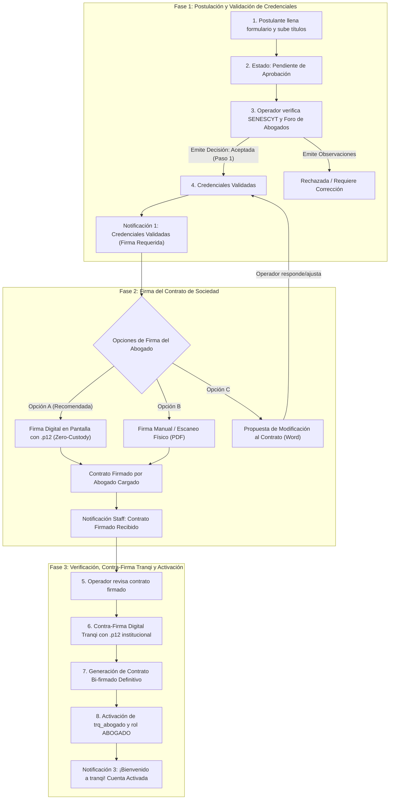
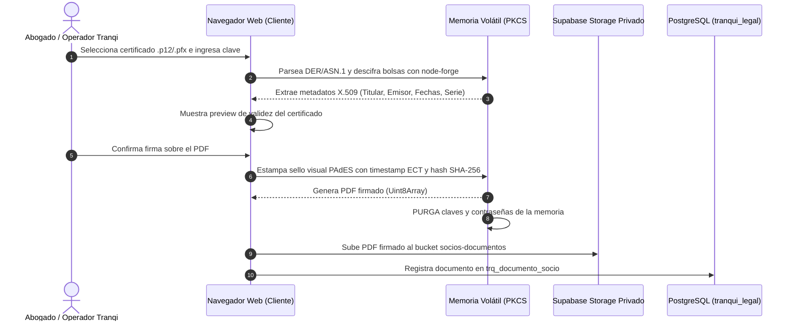

# Módulo: socios (Red y Acreditación de Socios Abogados)

Implementa **TRQ-ABG-001** (Onboarding y Acreditación de Socios Abogados), **TRQ-ABG-003** (Firma Electrónica Avanzada PAdES Zero-Custody) y **TRQ-ADM-001** (Mesa de Control y Contra-Firma Tranqi) — ver:
- [`gobernanza/productos/tranqi/especificacion-funcional.md`](../../../../gobernanza/productos/tranqi/especificacion-funcional.md)
- [`gobernanza/productos/tranqi/especificacion-tecnica.md`](../../../../gobernanza/productos/tranqi/especificacion-tecnica.md)

**Propio de Tranqi, no compartido.** A diferencia de identidad/configuración-negocio/gestión-usuarios (PLT-xxx, en `packages/*`), la red de abogados y su proceso de colegiatura y contratación bilateral es exclusivo de este negocio — reside en `apps/tranqi-web/modulos/socios/`.

---

## 1. Diagrama de Flujo y Ciclo de Vida (3 Fases de Acreditación)



---

## 2. Arquitectura de Firma Digital Zero-Custody (`.p12` / PAdES)

Conforme a la Ley de Comercio Electrónico, Firmas Electrónicas y Mensajes de Datos del Ecuador y los pilares de seguridad de Tranqi (`legaltech-lpms-tranqi-framework`):



### Principios de Seguridad:
1. **Cero Custodia (Zero-Custody):** La contraseña y el archivo `.p12` **NUNCA** se transmiten por red ni se almacenan en la nube o bases de datos. Todo el descifrado y estampado criptográfico ocurre dentro del navegador del usuario.
2. **Compatibilidad Nacional:** Soporta entidades de certificación de información autorizadas en Ecuador (Security Data, Banco Central del Ecuador, Consejo de la Judicatura, ANFAC, Uanataca, etc.).
3. **Estampa Visual PAdES:** Incluye recuadro institucional con nombre del firmante, entidad emisora, timestamp oficial de Ecuador (ECT), razón jurídica, número de serie y sello de integridad.

---

## 3. Matriz de Estados y Notificaciones

| Fase | Estado (`ssc_estado`) | Chip UI | Notificación Despachada | Canales | Destinatario |
| :--- | :--- | :--- | :--- | :--- | :--- |
| **Fase 1** | `enviada` / `en_revision` | `⏳ Postulación Inicial` | *"Solicitud de Socio Abogado Recibida"* | In-App, Push, Email | Postulante & Staff |
| **Fase 1 Final** | `aceptada` (Paso 1) | `✍️ Esperando Firma Abogado` | **Notif 1:** *"📋 ¡Credenciales Validadas! — Descarga y Firma tu Contrato"* | In-App, Push, Email | Postulante |
| **Fase 2** | `contrato_subido` | `📄 Contrato Listo para Contra-firma` | **Notif 2:** *"📝 Contrato Firmado Recibido — Listo para Verificación y Contra-Firma"* | In-App, Push, Email | Staff Operaciones |
| **Fase 3 Final** | `aceptada` (Contrato confirmado) | `🎉 Contrato Bi-firmado (Activo)` | **Notif 3:** *"🎉 ¡Bienvenido a tranqi! Contrato Bi-firmado y Cuenta Activada"* | In-App, Push, Email | Nuevo Socio Abogado |
| **Observada** | `rechazada` | `⚠️ Requiere Corrección` | *"⚠️ Observaciones sobre tu Solicitud de Socio Abogado"* | In-App, Push, Email | Postulante |

---

## 4. Estructura de Archivos del Módulo

```
modulos/socios/
├── README.md                                  # Documentación técnica y diagramas de arquitectura
├── esquema.ts                                 # Validaciones Zod, tipos de datos y constantes
├── consultas.ts                               # Consultas de solicitudes, jerarquía de urgencias y detalle
├── acciones.ts                                # Server Actions: decidir, confirmar contrato, notificaciones
├── servicios/
│   └── servicioFirmaDigital.ts               # Parser PKCS#12 (node-forge) y estampador PAdES (pdf-lib)
└── componentes/
    ├── ModalFirmaDigitalPdf.tsx               # Modal interactivo de firma electrónica Zero-Custody
    ├── GestionContratoPostulante.tsx          # Panel del postulante (Firma .p12, manual o propuesta Word)
    ├── BotonConfirmarContrato.tsx             # Panel de contra-firma institucional Tranqi y activación
    ├── FormularioSolicitudSocio.tsx           # Formulario de postulación y acreditación inicial
    ├── AccionesSolicitud.tsx                  # Botones de decisión de credenciales (Paso 1)
    ├── ConfiguracionContratoAbogadoWidget.tsx # Editor de plantilla de contrato para administradores
    └── SubirDocumentoRevision.tsx             # Respaldo documental de operadores
```

---

## 5. Endpoints de API Relacionados

- `GET /api/solicitud-socio/contrato/pdf?solicitudId={id}`: Genera en tiempo real el PDF A4 vectorial del contrato pre-llenado con los datos del postulante y cláusulas vigentes.
- `GET /api/solicitud-socio/contrato/descargar?solicitudId={id}`: Descarga la plantilla pre-llenada en formato Word (`.docx`).
- `GET /api/solicitud-socio/contrato/firmado?solicitudId={id}`: Retorna el archivo de contrato firmado / bi-firmado almacenado en Supabase Storage mediante URL firmada.
