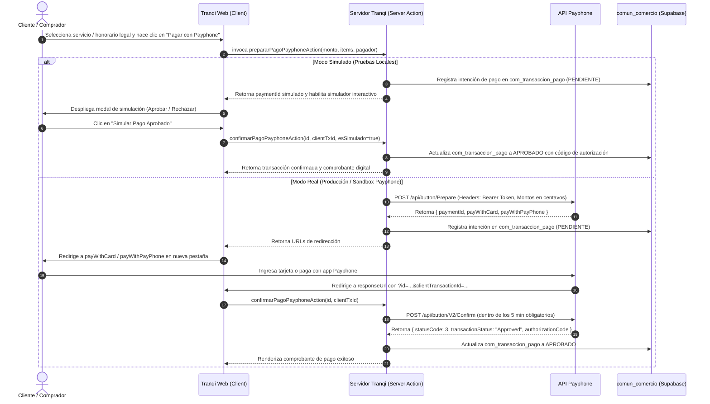

# Integración Técnica: Botón de Pago Payphone (API Prepare & Confirm)

**Fecha:** 2026-09-06  
**Estándar:** ADR-0003, PLT-009, PLT-006  
**Documentación Oficial de Referencia:** [https://docs.payphone.app/boton-de-pago](https://docs.payphone.app/boton-de-pago)  
**Ambiente:** Web / REST API  

---

## 1. Visión General y Flujo de Integración

Payphone proporciona una pasarela de cobro por redirección que admite tarjetas de crédito y débito (**Visa, MasterCard, Diners Club, Discover**) y saldo de la billetera digital Payphone.

La arquitectura opera en un **ciclo de dos fases (Prepare-Confirm)**:



---

## 2. Especificación de Endpoints y Payloads

### 2.1 Fase 1: Preparación de la Transacción (`/api/button/Prepare`)

- **Método:** `POST`
- **URL Oficial:** `https://pay.payphonetodoesposible.com/api/button/Prepare`
- **Cabeceras Obligatorias:**
  * `Authorization: Bearer <TOKEN_PRIVADO_APLICACION>`
  * `Content-Type: application/json`

#### Estructura del Payload JSON

> [!IMPORTANT]
> **Valores monetarios en centavos:** Todos los montos deben expresarse como enteros multiplicados por 100 (ejemplo: $100.00 se envía como `10000`, $15.00 como `1500`, $115.00 como `11500`).
> **Regla de suma estricta:** `amount = amountWithoutTax + amountWithTax + tax + service + tip`.

```json
{
  "amount": 17250,
  "amountWithoutTax": 0,
  "amountWithTax": 15000,
  "tax": 2250,
  "service": 0,
  "tip": 0,
  "clientTransactionId": "TRQ-TRX-1725624890-AB12",
  "reference": "Honorarios Patrocinio Legal - Tranqi",
  "storeId": "your_storeId",
  "currency": "USD",
  "responseUrl": "https://tranqi.ec/panel/pagos/confirmacion",
  "cancellationUrl": "https://tranqi.ec/panel/pagos/cancelacion",
  "timeZone": -5,
  "order": {
    "billTo": {
      "firstName": "Kleber",
      "lastName": "Toapanta",
      "email": "cliente@ejemplo.com",
      "phoneNumber": "+593999999999",
      "customerId": "0102030405",
      "country": "EC"
    },
    "lineItems": [
      {
        "productName": "Patrocinio en Trámite Extrajudicial / Mediación",
        "unitPrice": 15000,
        "quantity": 1,
        "totalAmount": 17250,
        "taxAmount": 2250,
        "productSKU": "TRQ-HON-PATROCINIO",
        "productDescription": "Honorarios profesionales de mediación legal"
      }
    ]
  }
}
```

#### Respuesta Satisfactoria (Prepare)

```json
{
  "paymentId": "GSizecyUkIAkxTj3SQ",
  "payWithPayPhone": "https://pay.payphonetodoesposible.com/PayPhone/Index?paymentId=GSizecyUkIAkxTj3SQ",
  "payWithCard": "https://pay.payphonetodoesposible.com/Anonymous/Index?paymentId=GSizecyUkIAkxTj3SQ"
}
```

---

### 2.2 Fase 2: Confirmación de la Transacción (`/api/button/V2/Confirm`)

- **Método:** `POST`
- **URL Oficial:** `https://pay.payphonetodoesposible.com/api/button/V2/Confirm`
- **Cabeceras Obligatorias:**
  * `Authorization: Bearer <TOKEN_PRIVADO_APLICACION>`
  * `Content-Type: application/json`

#### Estructura del Payload JSON (Confirm)

```json
{
  "id": 1234567,
  "clientTxId": "TRQ-TRX-1725624890-AB12"
}
```

#### Respuesta de Transacción Aprobada (Confirm)

```json
{
  "statusCode": 3,
  "transactionStatus": "Approved",
  "clientTransactionId": "TRQ-TRX-1725624890-AB12",
  "authorizationCode": "AUTH-789012",
  "transactionId": 1234567,
  "email": "cliente@ejemplo.com",
  "phoneNumber": "+593999999999",
  "document": "0102030405",
  "amount": 17250,
  "cardType": "CREDITO",
  "cardBrand": "Visa",
  "lastDigits": "1234",
  "currency": "USD",
  "reference": "Honorarios Patrocinio Legal - Tranqi",
  "date": "2026-09-06T12:30:00.000Z"
}
```

---

## 3. Normativa de Seguridad y Mitigaciones Obligatorias

### 3.1 Regla del Reverso Automático a los 5 Minutos

> [!WARNING]
> Si el servidor del comercio **no ejecuta la solicitud de confirmación dentro de los 5 minutos posteriores al pago del usuario**, Payphone cancela y reversa automáticamente la transacción bancaria.

**Estrategia en el Ecosistema:**
1. Al capturar la redirección en `responseUrl`, la Server Action ejecuta de inmediato la llamada a `/api/button/V2/Confirm`.
2. Se registra de manera atómica el resultado en `comun_comercio.com_transaccion_pago`.

### 3.2 Normativa PCI DSS (Prohibición de IFrames y WebViews)

- Los enlaces de pago devueltos (`payWithCard` / `payWithPayPhone`) **nunca deben incrustarse dentro de iframes o webviews**.
- Deben abrirse directamente en una nueva pestaña del navegador para asegurar el aislamiento criptográfico exigido por las marcas de tarjetas.

---

## 4. Modo Simulado (Sandbox de Pruebas sin Dinero Real)

Para facilitar el aseguramiento de calidad y las pruebas operativas sin necesidad de ingresar tarjetas de crédito reales ni tokens en producción:

1. **Interruptor de Modo Simulado:** En `comun_comercio.com_pasarela_configuracion`, la pasarela Payphone cuenta con la propiedad `modoSimulado = true`.
2. **Checkout Interactivo:** El modal de checkout permite alternar entre **Modo Simulado** y **Modo Real**.
3. **Flujo de Simulación:**
   - La Server Action emite un identificador virtual (`SIM-TRX-...`).
   - El usuario visualiza una pantalla de simulación con dos botones de acción:
     * `[Simular Pago Aprobado]` → Confirma la transacción con código de autorización bancario simulado (ej. `AUTH-SIM-XXXXXX`) y guarda el registro con estado `APROBADO`.
     * `[Simular Pago Rechazado]` → Registra el evento con estado `RECHAZADO` para probar manejo de excepciones de fondos insuficientes.
   - Ambos caminos registran la auditoría en `com_transaccion_pago` y emiten el comprobante para que el comprador verifique el resultado.
