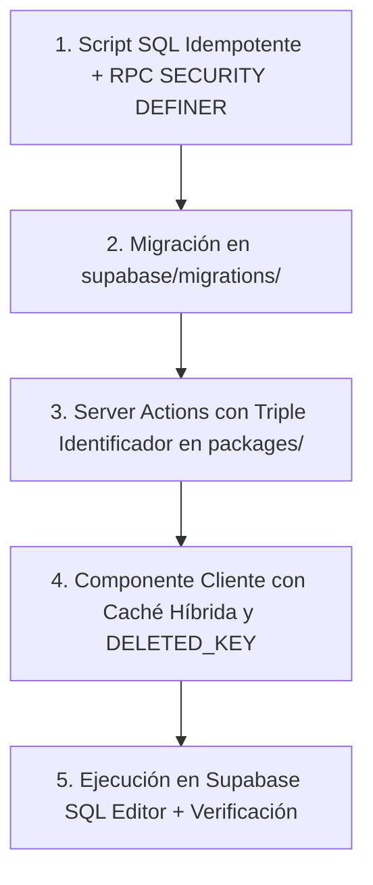

# Estándar de Implementación de Nuevas Funcionalidades: Persistencia BDD, RPCs, Permisos y Resiliencia

**Código:** `STD-006`  
**Ámbito:** Monorepo Ecosistema (`apps/*`, `packages/*`, `supabase/*`)  
**Propósito:** Establecer el protocolo obligatorio paso a paso para crear nuevas entidades, widgets y módulos con persistencia real garantizada en PostgreSQL/Supabase, eliminando errores de permisos, fallos de RLS y reaparición de datos borrados.

---

## 1. ¿Por qué ocurría el problema de "borro y vuelve a cargarse todo"?

El fallo de persistencia que causa que datos eliminados o editados reaparezcan al recargar la página se debe a una combinación de 4 factores:

| Causa Raíz | Qué sucedía | Solución Obligatoria |
| :--- | :--- | :--- |
| **1. Discrepancia ID Semilla vs UUID BDD** | El frontend usaba IDs de texto (`noticia-001`, `beneficio-02`) de datos de ejemplo, pero la tabla en PostgreSQL usaba `UUID`. Al ejecutar `DELETE WHERE id = 'noticia-001'`, PostgreSQL no borraba nada. | **Triple Identificador**: Todo borrado y actualización debe ejecutarse por `UUID`, por `slug` y por `título/código único`. |
| **2. Fallo de Permisos RLS / Esquema** | La función o política SQL fallaba silenciosamente por referenciar tablas inexistentes o no tener permisos de ejecución `GRANT EXECUTE TO authenticated, anon, service_role`. | **Funciones `SECURITY DEFINER`** con `SET search_path` y grants explícitos a todos los roles de Supabase. |
| **3. Fallback de Semillas Incondicional** | Al reiniciar el servidor (cold-start) o fallar la consulta a BDD, la Server Action devolvía de nuevo el array de semillas completo sin verificar si habían sido eliminados. | **Registro de Exclusión (`DELETED_KEY` & `eliminadosMemoria`)**: Tanto en cliente (`localStorage`) como en memoria del servidor se registran los IDs/slugs/títulos borrados para que **nunca resuciten**. |
| **4. Sin Sincronización Inmediata en Cliente** | El cliente no actualizaba su caché local (`localStorage`) inmediatamente al recibir el borrado/edición. | **Caché Híbrida 0ms**: Actualizar `localStorage` en el mismo instante en que se confirma la acción. |

---

## 2. El Protocolo de 5 Pasos para Nuevas Funcionalidades

Al implementar cualquier nueva funcionalidad con persistencia (ej. catálogo, banners, convenios, trámites, tarifas):



---

### Paso 1: Diseño SQL Idempotente y Permisos (Supabase)

Toda tabla nueva debe seguir la [Nomenclatura BDD](00-nomenclatura-base-datos.md) y contar con sus funciones RPC transaccionales:

#### Reglas de Oro SQL:
1. **Esquema correcto**: Usar siempre el esquema asignado (`comun_comercio`, `comun_seguridad`, `tranqui_legal`, etc.).
2. **`SECURITY DEFINER`**: Toda función de guardado, actualización o borrado debe crearse con `SECURITY DEFINER` y `SET search_path = public, comun_comercio, comun_seguridad, comun_auditoria`.
3. **Manejo de UUID vs Slugs**:
   ```sql
   -- Ejemplo de borrado resiliente por UUID o Slug
   CREATE OR REPLACE FUNCTION comun_comercio.com_fn_eliminar_campana_informativa(
       p_negocio TEXT,
       p_id_o_slug TEXT
   )
   RETURNS JSONB
   LANGUAGE plpgsql
   SECURITY DEFINER
   SET search_path = public, comun_comercio, comun_seguridad
   AS $$
   DECLARE
       v_borrados INT := 0;
   BEGIN
       -- 1. Intentar por UUID si es válido
       IF p_id_o_slug ~* '^[0-9a-f]{8}-[0-9a-f]{4}-[0-9a-f]{4}-[0-9a-f]{4}-[0-9a-f]{12}$' THEN
           DELETE FROM comun_comercio.com_campana_informativa
           WHERE inf_id = p_id_o_slug::uuid AND inf_negocio = lower(trim(p_negocio));
           GET DIAGNOSTICS v_borrados = ROW_COUNT;
       END IF;

       -- 2. Si no borró por UUID, borrar por slug
       IF v_borrados = 0 THEN
           DELETE FROM comun_comercio.com_campana_informativa
           WHERE inf_slug = p_id_o_slug AND inf_negocio = lower(trim(p_negocio));
           GET DIAGNOSTICS v_borrados = ROW_COUNT;
       END IF;

       RETURN jsonb_build_object('ok', true, 'borrados', v_borrados);
   END;
   $$;
   ```
4. **Permisos Mandatorios (`GRANTS`)**:
   ```sql
   GRANT USAGE ON SCHEMA comun_comercio TO anon, authenticated, service_role;
   GRANT ALL ON ALL TABLES IN SCHEMA comun_comercio TO authenticated, service_role;
   GRANT SELECT ON ALL TABLES IN SCHEMA comun_comercio TO anon;
   GRANT EXECUTE ON ALL FUNCTIONS IN SCHEMA comun_comercio TO anon, authenticated, service_role;
   ```

---

### Paso 2: Archivo de Migración

Guardar siempre el archivo con el timestamp correspondiente en `supabase/migrations/YYYYMMDD00000X_nombre_descriptivo.sql`.

---

### Paso 3: Server Action con Triple Identificador (`packages/*`)

En la Server Action (`acciones-*.ts`):

1. **Mapeo de Semillas a Slugs**:
   ```typescript
   const MAPA_ID_A_SLUG: Record<string, string> = {};
   CAMPANAS_SEMILLA.forEach((c) => {
     MAPA_ID_A_SLUG[c.inf_id] = c.inf_slug;
   });
   ```

2. **Borrado Multi-Identificador**:
   ```typescript
   export async function eliminarItemAction(
     negocio: string,
     id: string,
     slug?: string,
     titulo?: string
   ): Promise<{ ok: boolean; error?: string }> {
     const slugFinal = MAPA_ID_A_SLUG[id] || slug;
     
     // 1. Marcar en memoria de exclusión del servidor
     eliminadosMemoria[negocio].add(id);
     if (slugFinal) eliminadosMemoria[negocio].add(slugFinal);
     if (titulo) eliminadosMemoria[negocio].add(titulo);

     // 2. Ejecutar RPC en Supabase
     // 3. Fallback: Borrar por UUID, por slug y por título en PostgreSQL
     ...
     return { ok: true };
   }
   ```

3. **Filtrado de Exclusiones en Lectura**:
   ```typescript
   // Nunca devolver un elemento que esté en el Set de eliminados
   const itemsLimpios = lista.filter(
     (item) => !eliminadosMemoria[negocio].has(item.id) &&
               !eliminadosMemoria[negocio].has(item.slug) &&
               !eliminadosMemoria[negocio].has(item.titulo)
   );
   ```

---

### Paso 4: Componente Cliente con Caché Híbrida (`packages/*`)

En el componente React (`*Widget.tsx`):

1. **Constantes de Claves de Caché**:
   ```typescript
   const CACHE_KEY = `eco_datos_${negocio}`;
   const DELETED_KEY = `eco_datos_eliminados_${negocio}`;
   ```

2. **Gestión de Eliminados Locales**:
   ```typescript
   const getEliminadosLocal = (): Set<string> => {
     if (typeof window === "undefined") return new Set();
     try {
       const raw = localStorage.getItem(DELETED_KEY);
       if (raw) return new Set(JSON.parse(raw));
     } catch {}
     return new Set();
   };

   const guardarEliminadoLocal = (id: string, slug?: string, titulo?: string) => {
     if (typeof window === "undefined") return;
     try {
       const set = getEliminadosLocal();
       if (id) set.add(id);
       if (slug) set.add(slug);
       if (titulo) set.add(titulo);
       localStorage.setItem(DELETED_KEY, JSON.stringify(Array.from(set)));
     } catch {}
   };
   ```

3. **Lectura Instantánea + Sincronización**:
   ```typescript
   const cargarDatos = async () => {
     const eliminados = getEliminadosLocal();
     
     // Carga instantánea desde localStorage
     const local = localStorage.getItem(CACHE_KEY);
     if (local) {
       const parsed = JSON.parse(local);
       setItems(parsed.filter((i) => !eliminados.has(i.id) && !eliminados.has(i.slug) && !eliminados.has(i.titulo)));
     }

     // Carga desde el servidor
     const data = await obtenerDatosAction({ negocio });
     if (Array.isArray(data)) {
       const limpios = data.filter((i) => !eliminados.has(i.id) && !eliminados.has(i.slug) && !eliminados.has(i.titulo));
       setItems(limpios);
       localStorage.setItem(CACHE_KEY, JSON.stringify(limpios));
     }
   };
   ```

4. **Borrado Seguro en UI**:
   ```typescript
   const handleEliminar = async (id: string, tit: string) => {
     if (!confirm(`¿Eliminar definitivamente "${tit}"?`)) return;
     const target = items.find((i) => i.id === id || i.slug === id);
     
     // 1. Guardar en set local de eliminados
     guardarEliminadoLocal(id, target?.slug, target?.titulo || tit);
     
     // 2. Actualizar estado y localStorage
     const actualizados = items.filter((i) => i.id !== id && i.slug !== id && (!i.titulo || i.titulo !== tit));
     setItems(actualizados);
     localStorage.setItem(CACHE_KEY, JSON.stringify(actualizados));

     // 3. Enviar al servidor con triple identificador
     await eliminarItemAction(negocio, id, target?.slug, target?.titulo || tit);
   };
   ```

---

### Paso 5: Entrega al Usuario y Verificación

1. **Entregar el bloque SQL completo** para que el usuario o superadmin lo pegue en el **Supabase SQL Editor** si la migración no está automatizada en CI/CD.
2. **Ejecutar `pnpm typecheck`** en el monorepo para certificar cero errores de tipos.
3. **Hacer commit y push** a `master` para disparar el build en Vercel.
4. **Instruir refresco forzado (`Ctrl + F5`)** al usuario en su navegador.

---

## 3. Matriz de Autochequeo Pre-Entrega

Antes de dar por completada cualquier nueva funcionalidad con persistencia:

- [ ] ¿La función SQL tiene `SECURITY DEFINER` y `SET search_path`?
- [ ] ¿Se ejecutaron los `GRANT EXECUTE` y `GRANT USAGE` para `anon, authenticated, service_role`?
- [ ] ¿La Server Action maneja borrado por UUID, Slug y Título (sin asumir que el ID siempre es UUID)?
- [ ] ¿El componente React tiene `DELETED_KEY` en `localStorage` para evitar que datos semilla resuciten?
- [ ] ¿`pnpm typecheck` pasa sin ningún error en los 15+ paquetes del monorepo?
