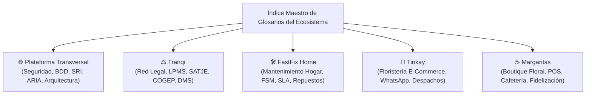

# Índice Maestro de Glosarios Técnicos del Ecosistema

**Fecha de Actualización:** 2026-09-06  
**Estado:** Documento Vivo e Indexador Central  
**Ubicación:** `gobernanza/manuales/glosario-de-terminos.md`  

Para garantizar la máxima claridad, mantenibilidad y modularidad, el glosario de términos técnicos, siglas y conceptos de producto del ecosistema está **dividido en 5 documentos individuales (.md) especializados por ámbito de aplicación**:

---

## 🗺️ Mapa de Glosarios Individuales

---

## 📚 Acceso a los Glosarios por Aplicación

| Ámbito / Aplicación | Esquemas de BDD | Ubicación del Glosario Individual (.md) | Temas Principales Cubiertos |
| :--- | :--- | :--- | :--- |
| **🌐 Plataforma Transversal** | `comun_seguridad` `comun_auditoria` `comun_facturacion` `comun_catalogo` `comun_agentes` `comun_comercio` `comun_agenda` | [glosario-plataforma.md](file:///c:/@Antigravity/ecosistema/gobernanza/productos/plataforma/glosario-plataforma.md) | ADR, DDL/DML, RLS, RPC, RBAC, Multi-tenancy, MFA/TOTP `aal2`, Zero-Custody, JWT, TTL, ARIA, HITL, OCR, Centavos Enteros, SRI, Claves de Acceso, Split Payment. |
| **⚖️ Tranqi (Red Legal)** | `tranqui_legal` (`trq_`) | [glosario-tranqi.md](file:///c:/@Antigravity/ecosistema/gobernanza/productos/tranqi/glosario-tranqi.md) | LPMS, Expediente Digital (*Matter* `TRQ-MAT-YYYY-XXXXX`), SATJE, COGEP, Términos Perentorios, Conflict Check, 5 Carpetas Procesales, PAdES `.p12`, Time Tracking, Retainers, Cuota Litis. |
| **🛠️ FastFix Home (Hogar)** | `fastfix_mantenimiento` (`ffh_`) | [glosario-fastfix.md](file:///c:/@Antigravity/ecosistema/gobernanza/productos/fastfix/glosario-fastfix.md) | FSM (*Field Service Management*), Managed Marketplace con garantía, SLA de emergencias (< 2h), Checklists técnicos móviles con fotos Antes/Después, BOM de repuestos, Bodega Móvil. |
| **🌸 Tinkay (Floristería Web)** | `tinkay_floristeria` (`tnk_`) | [glosario-tinkay.md](file:///c:/@Antigravity/ecosistema/gobernanza/productos/tinkay/glosario-tinkay.md) | Venta conversacional WhatsApp (YCloud / ARIA), *Delivery Window*, *Exact Time Surcharge*, Galerías Google Photos, BOM Floral, Merma, Base Comisionable Neta, Dedicatorias QR. |
| **☕ Margaritas (Floristería & Café)** | `margaritas_floristeria` (`mrg_`) | [glosario-margaritas.md](file:///c:/@Antigravity/ecosistema/gobernanza/productos/margaritas/glosario-margaritas.md) | POS táctil de mostrador, Comanda Dividida (Barra Café / Taller Floral), Venta Híbrida / Cruzada, BOM de insumos gastronómicos y Tarjeta de Sellos de Fidelización. |

---

## 📌 Regla de Gobernanza y Mantenimiento

> **Regla de Actualización Obligatoria:**  
> Cuando se cree o modifique un término técnico o sigla de producto, el desarrollador o agente de IA debe actualizar **el archivo `.md` específico del producto correspondiente**. Este archivo maestro sirve como índice general y tabla de contenidos.
