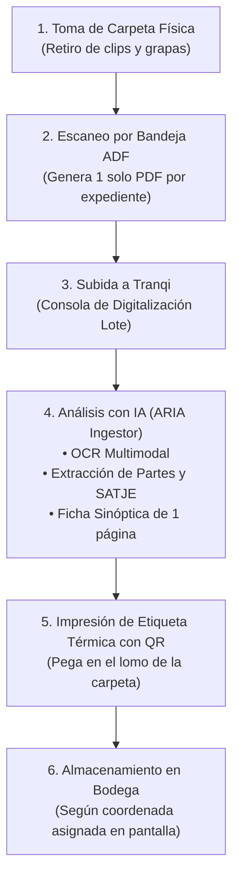
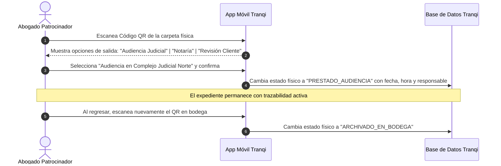

# Guía Operativa: Digitalización de Archivo Físico, Expedientes Digitales y Gestión de Custodia (Tranqi Legal)

**Código:** `MAN-TRQ-EXP-001`  
**Versión:** `1.0.0`  
**Dirigido a:** Operadores de Archivo, Asistentes Legales, Abogados Patrocinadores y Administradores de Despacho.

---

## 1. Introducción y Propósito

Esta guía describe el procedimiento operativo estándar para:
1. **Migrar carpetas físicas históricas** al Expediente Digital Unificado de Tranqi.
2. **Organizar la bodega y escaparates físicos** mediante coordenadas topológicas y códigos QR.
3. **Buscar y extraer carpetas físicas en menos de 15 segundos**.
4. **Controlar la cadena de custodia y préstamos** hacia juzgados, notarías y audiencias.
5. **Gestionar la privacidad y portabilidad** para clientes particulares, empresas y trabajadores beneficiados por convenios B2B2C.

---

## 2. Flujo Operativo de Digitalización Masiva (Paso a Paso)



### Paso 1: Preparación del Expediente Físico
1. Tome la carpeta física del archivador pasivo.
2. Retire grapas metálicas, clips o notas adhesivas que puedan trabar el alimentador del escáner.
3. Verifique que las fojas estén ordenadas cronológicamente (foja 1 al inicio).

### Paso 2: Escaneo en Lote (Bandeja ADF)
1. Coloque el fajo de hojas en la bandeja de entrada del escáner de producción (ej. 50 a 100 fojas).
2. Configure el escáner a **300 DPI, escala de grises o color, con doble cara automática activada**.
3. Presione **Escanear**. El escáner generará un único archivo PDF continuo (ej. `Expediente_Juan_Perez.pdf`).

### Paso 3: Carga y Procesamiento en Tranqi
1. Ingrese a la plataforma Tranqi con su cuenta de operador/abogado.
2. Vaya a **Módulo de Archivo & Digitalización (`TRQ-DIG-001`)** $\rightarrow$ **Nuevo Lote de Ingesta**.
3. Arrastre el archivo PDF escaneado.
4. El agente de IA (**ARIA Ingestor**) ejecuta automáticamente:
   - **OCR y Lectura Completa**: Reconoce todo el texto impreso o mecanografiado.
   - **Detección de Partes Procesales**: Identifica al Cliente (Actor/Demandado), Contraparte, Juzgado, Número de Causa SATJE y Cuantía.
   - **Auto-Clasificación en Carpetas DMS**:
     - `01. Identificación y Poderes`: Cédulas, RUCs y poderes notariales.
     - `02. Pruebas y Evidencias`: Contratos, facturas, peritajes y fotos.
     - `03. Escritos Judiciales`: Demandas, minutas y contestaciones.
     - `04. Providencias`: Autos de calificación y sentencias.
     - `05. Facturación`: Aranceles y comprobantes.
   - **Ficha Sinóptica**: Genera un resumen ejecutivo de 1 página con el estado actual de la causa y recomendaciones.

### Paso 4: Impresión y Pegado de la Etiqueta QR
1. Al confirmarse el expediente, la impresora térmica imprime la **Etiqueta Adhesiva de Lomo**:
   ```
   ┌────────────────────────────────────────┐
   │ 🟦 AZUL (MATERIA CIVIL)                │
   │                                        │
   │  #14                                   │
   │  TRQ-MAT-2026-00042                    │
   │                                        │
   │  PÉREZ MORALES, JUAN                   │
   │  Juicio: 17203-2026-0034               │
   │  Ubicación: MOD-3 / N-2 / CJ-08        │
   │                                        │
   │  [  QR CODE  ]                         │
   │  [  ███████  ]                         │
   └────────────────────────────────────────┘
   ```
2. Pegue la etiqueta en el lomo exterior de la carpeta física.

### Paso 5: Almacenamiento en Bodega
1. Lleve la carpeta física a la coordenada indicada en la etiqueta (ej. `MÓDULO 3` $\rightarrow$ `NIVEL 2` $\rightarrow$ `CAJA 08`).
2. Colóquela en la posición correlativa `#14`.

---

## 3. Guía de Localización Física en 15 Segundos

### ¿Cómo saber qué carpeta tomar en los escaparates?

1. **Búsqueda en Tranqi**: Ingrese al buscador de expedientes y escriba el nombre del cliente, número de cédula o número de juicio.
2. **Lectura de la Coordenada Topológica**: La pantalla mostrará:
   * **Bodega**: *Matriz Quito (Piso 2)*
   * **Escaparate / Módulo**: *MÓDULO 3*
   * **Repisa / Nivel**: *NIVEL 2*
   * **Caja de Archivo**: *CAJA CJ-08*
   * **Posición**: *Carpeta #14 (Banda Azul)*
3. **Extracción en Bodega**:
   - Camine al Módulo 3.
   - Mire la repisa Nivel 2.
   - Extraiga la Caja CJ-08.
   - Tome la carpeta con la pestaña `#14` y borde azul de Juan Pérez.
4. **Validación Inmediata con el Celular**:
   - Abra la cámara o la app de Tranqi en su celular y apunte al QR del lomo.
   - La app emitirá un tono de confirmación: `🟢 Confirmado: Expediente Juan Pérez`.

---

## 4. Cadena de Custodia y Control de Préstamos (*Check-in / Check-out*)

Para evitar extravíos de expedientes cuando un abogado sale a audiencias o notarías:



---

## 5. Reglas de Privacidad y Portabilidad B2B2C (Empresas y Empleados)

| Tipo de Cliente | Titularidad Legal | Acceso a Documentos | En caso de Desvinculación de la Empresa |
| :--- | :--- | :--- | :--- |
| **Persona Natural (B2C)** | El propio cliente | Exclusivo del cliente y su abogado | Mantiene su cuenta y expediente de por vida. |
| **Empresa / Corporativo (B2B)** | La persona jurídica (RUC) | Representantes legales y apoderados | Los casos de la empresa permanecen en la empresa. |
| **Empleado con Convenio (B2B2C)** | **El empleado** (Secreto Profesional) | Exclusivo del empleado y su abogado (la empresa NO puede ver el contenido del caso) | **Portabilidad Total:** El empleado conserva su cuenta y el 100% de sus expedientes personales; pasa automáticamente a tarifa B2C individual. |

---

## 6. Buenas Prácticas y Preguntas Frecuentes

* **¿Qué hago si una foja física está rota o dañada?**  
  Escanee la foja con una funda protectora transparente para escáner y active la opción "Reparación Digital de Documentos Antiguos" en el panel de ARIA.
* **¿Qué ocurre si el código QR físico se ensucia o raya?**  
  Cada etiqueta incluye el código amigable impreso en texto grande (`TRQ-MAT-2026-00042`). Si el QR no lee, el operador puede escribir o dictar ese código en la app.
* **¿Puedo consultar los documentos del expediente desde el celular en la audiencia?**  
  Sí. El expediente digital cuenta con visor optimizado para móviles y búsqueda en vivo de texto dentro de las fojas escaneadas.
