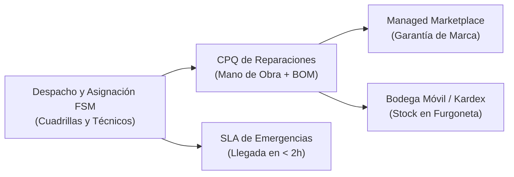

# Glosario Técnico y de Términos — FastFix Home (Mantenimiento del Hogar)

**Aplicación:** `apps/fastfix-web` · **Esquema BDD:** `fastfix_mantenimiento` · **Prefijo de tablas:** `ffh_`  
**Ubicación:** `gobernanza/productos/fastfix/glosario-fastfix.md`  

---

## 1. Módulos y Dominio de Mantenimiento en Campo (FSM)

| Sigla / Término | Categoría | Explicación y Aplicación en FastFix |
| :--- | :--- | :--- |
| **FSM** | Dominio | *Field Service Management*: Gestión y despacho de técnicos en campo, georutas, visitas a domicilio y órdenes de trabajo en sitio. |
| **Managed Marketplace** | Modelo Comercial | Modelo de negocio donde FastFix atiende con cuadrilla propia y homologa técnicos externos (plomeros, electricistas), manteniendo la facturación y la **Garantía FastFix** ante el cliente. |
| **SLA de Emergencia Hogar** | Operaciones | *Service Level Agreement*: Tiempo máximo garantizado de arribo del técnico al domicilio (ej. fuga de agua grave o corte de energía en menos de 120 minutos). |
| **Checklist de Visita Técnica** | Operaciones | Formulario digital obligatorio en la app del técnico que captura fotos del "Antes" y "Después", mediciones de voltaje/presión y firma táctil de recepción conforme. |
| **Visita de Diagnóstico** | Comercial | Tarifa base de inspección técnica en domicilio que se descuenta del costo total si el cliente aprueba el presupuesto de reparación. |

---

## 2. Repuestos, Inventario y Materiales (BOM)

| Sigla / Término | Categoría | Explicación y Aplicación en FastFix |
| :--- | :--- | :--- |
| **BOM de Reparación** | Inventario | *Bill of Materials*: Receta de repuestos e insumos requeridos para un servicio (ej. mantenimiento de calefón = termostato + sensor de llama + cinta teflón + 2 empaques de gas). |
| **Bodega Móvil / Furgoneta** | Logística | Sub-bodega física asignada a cada técnico para transportar repuestos de alta rotación con control de Kardex diario. |
| **Kardex de Repuestos** | Inventario | Registro de entradas, salidas por servicios ejecutados y devoluciones de repuestos defectuosos a proveedores. |
| **Garantía de Mano de Obra** | Servicio | Cobertura estándar (ej. 90 días) sobre las reparaciones efectuadas, con re-visita sin costo ante fallas imputables al servicio. |
