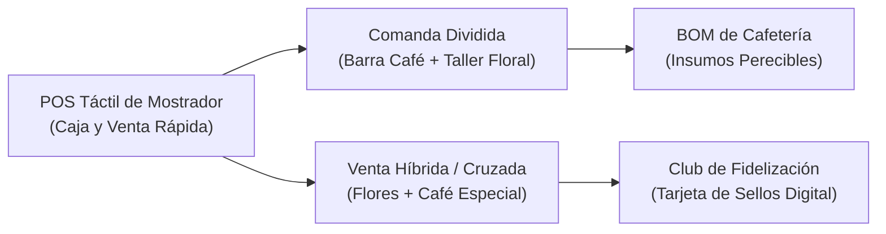

# Glosario Técnico y de Términos — Margaritas (Boutique Floral & Cafetería)

**Aplicación:** `apps/margaritas-web` · **Esquema BDD:** `margaritas_floristeria` · **Prefijo de tablas:** `mrg_`  
**Ubicación:** `gobernanza/productos/margaritas/glosario-margaritas.md`  

---

## 1. Operación de Mostrador (POS), Cafetería y Taller

| Sigla / Término | Categoría | Explicación y Aplicación en Margaritas |
| :--- | :--- | :--- |
| **POS de Mostrador** | Retail | *Point of Sale*: Interfaz táctil ultrarrápida para toma de pedidos en caja física, cobro instantáneo (efectivo, tarjeta, Deuna QR) e impresión de comanda. |
| **Comanda Dividida (Barra / Taller)** | Operaciones | Orden de compra que se desglosa automáticamente al emitirse: la sección de bebidas va a la cafetera y la sección de flores va a la mesa de diseño floral. |
| **Venta Híbrida / Cruzada** | Comercial | Oferta combinada de ramos florales de boutique junto a café de especialidad, desayunos sorpresa y repostería artesanal. |
| **BOM de Cafetería** | Producción | Receta por producto gastronómico (ej. Capuchino = 18g café espresso + 200ml leche entera + vaso ecológico + servilleta). |
| **Tarjeta de Sellos / Fidelización** | Fidelización | Módulo que premia a clientes recurrentes (ej. cada 8 consumos de café o 3 compras de arreglos otorga un consumo de cortesía). |
