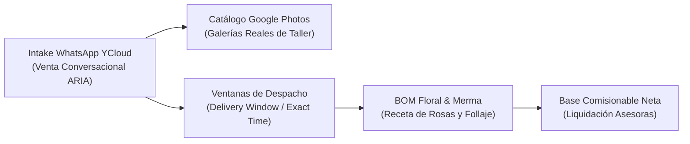

# Glosario Técnico y de Términos — Tinkay (Floristería E-Commerce & Regalos)

**Aplicación:** `apps/tinkay-web` · **Esquema BDD:** `tinkay_floristeria` · **Prefijo de tablas:** `tnk_`  
**Ubicación:** `gobernanza/productos/tinkay/glosario-tinkay.md`  

---

## 1. Venta Conversacional WhatsApp & Catálogo

| Sigla / Término | Categoría | Explicación y Aplicación en Tinkay |
| :--- | :--- | :--- |
| **Conversational Intake** | Venta IA | Flujo asistido por ARIA que captura el pedido íntegro (producto, dedicatoria, fecha, franja, dirección y comprobante) dentro de WhatsApp sin redirecciones externas. |
| **Álbumes Google Photos** | Catálogo | Enlaces a galerías compartidas (`photos.app.goo.gl/...`) asociados a categorías de producto para compartir fotos reales de taller de alta resolución sin saturar Storage. |
| **Dedicatoria con QR** | Producto | Tarjeta impresa con código QR que enlaza a un mensaje de audio, video o galería privada dedicada al destinatario del arreglo. |
| **Atribución ARIA** | Comercial | Mecanismo por el cual ARIA asigna automáticamente una venta a una asesora humana mediante enlaces de referidos (`?asesora=paola`) o turnos rotativos. |

---

## 2. Logística de Despacho y Taller Floral

| Sigla / Término | Categoría | Explicación y Aplicación en Tinkay |
| :--- | :--- | :--- |
| **Delivery Window** | Logística | *Franja de Entrega Flexible*: Ventana horaria amplia (ej. 09:00 - 13:00 / 14:00 - 18:00) donde la furgoneta optimiza la ruta de despacho sin costo adicional. |
| **Exact Time Surcharge** | Logística | Recargo automático (ej. +$10.00) cobrado cuando el cliente exige una entrega en un minuto exacto (ej. 07:00 AM) fuera del circuito estándar. |
| **BOM Floral (Receta de Taller)** | Producción | Lista de insumos que componen el arreglo: número de tallos de rosas, follaje, papel coreano, cinta y florero de vidrio. |
| **Merma Floral** | Inventario | Descarte de tallos marchitos o botones rotos durante el proceso de hidratación y armado para el cálculo exacto del costo de venta (COGS). |
| **Base Comisionable Neta** | Finanzas | Valor neto de la orden sobre el cual se liquida la comisión de la asesora, tras descontar flete real, costos de pasarela y cupones. |
