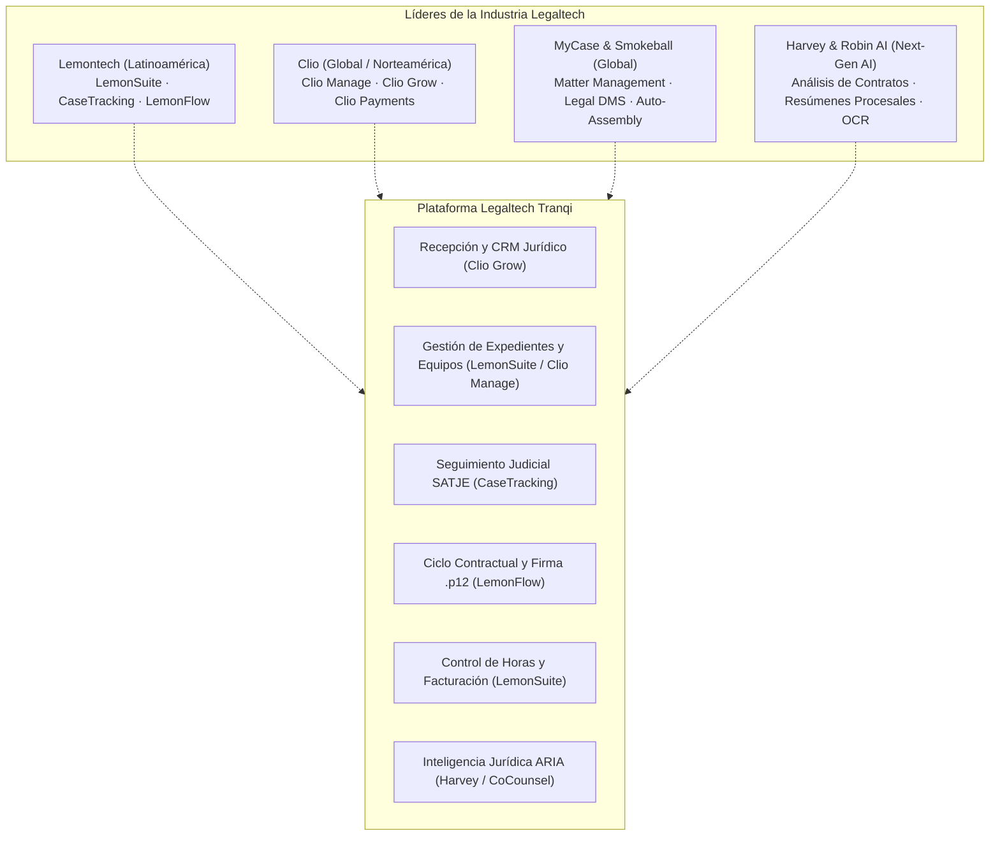
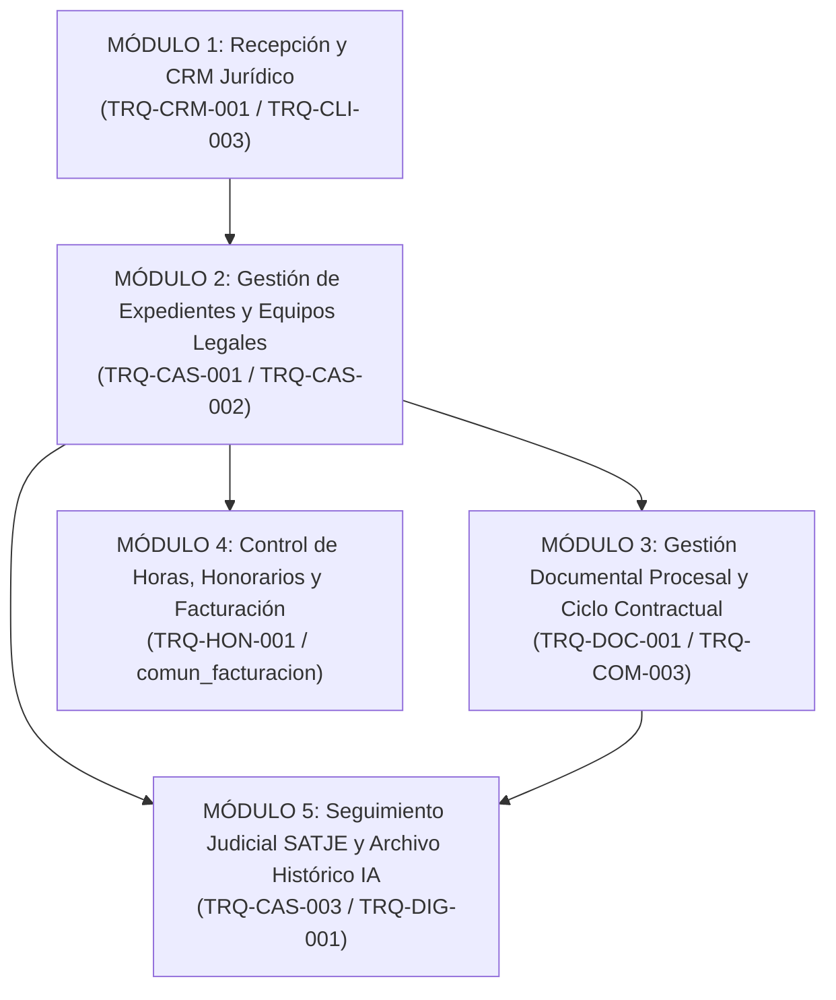
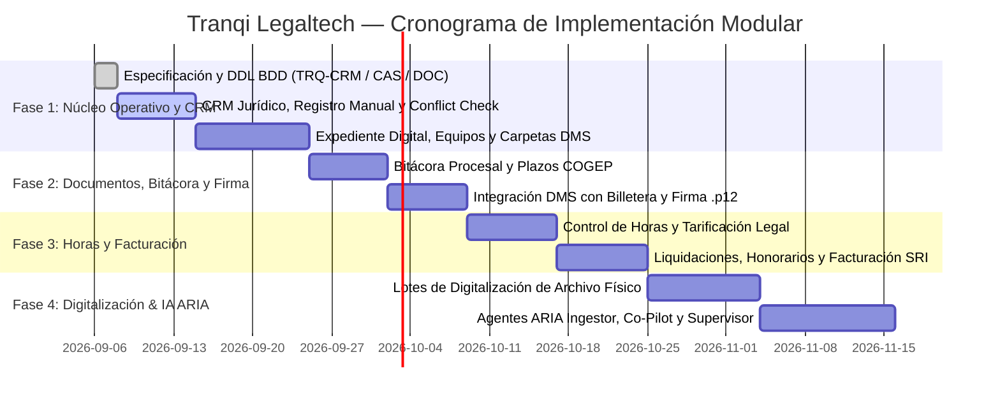

# Tranqi — Benchmark de Líderes Legaltech y Roadmap de Implementación Modular

Este documento consolida el análisis de mercado de los referentes de la industria **Legaltech** a nivel global y regional, extrayendo los patrones de éxito para posicionar a **Tranqi** como una plataforma integral de práctica jurídica (*Law Practice Management Software* - LPMS, *Contract Lifecycle Management* - CLM y *Legal Marketplace*) adaptada a la legislación ecuatoriana y potenciada con agentes de IA autónomos (**ARIA**).

---

## 1. Análisis de Líderes de la Industria

---

### 1.1. Lemontech (Referente Líder en Latinoamérica)

| Producto Lemontech | Enfoque Principal | Capacidades Clave a Replicar / Adaptar en Tranqi |
| :--- | :--- | :--- |
| **LemonSuite** | Operación legal centralizada para firmas jurídicas y despachos. | • **Registro de Horas:** Cronómetro por caso, tarificación por abogado/categoría. • **Gestión de Proyectos Legales:** Hitos procesales, presupuestos y control de costos. • **Facturación y Cobranza:** Anticipos, liquidación de honorarios y reportes de rentabilidad. • **Panel Ejecutivo:** Indicadores de productividad, casos abiertos/cerrados y carga laboral. |
| **CaseTracking** | Seguimiento judicial automatizado y sincronización con tribunales. | • **Sincronización Judicial:** Monitoreo diario de expedientes en sistemas judiciales (SATJE en Ecuador). • **Alertas de Providencias:** Notificación inmediata al publicarse un auto o sentencia. • **Bitácora Automatizada:** Registro cronológico de movimientos del juzgado sin intervención manual. |
| **LemonFlow (CLM)** | Gestión del ciclo de vida contractual (*Contract Lifecycle Management*). | • **Solicitud a la Firma:** Flujo completo desde el requerimiento del cliente hasta el contrato bi-firmado. • **Aprobaciones Multinivel:** Circuitos de revisión interna antes de emisión. • **Firma Electrónica Integrada:** Firma con validez jurídica oficial (PKCS#12 / PAdES). |

---

### 1.2. Clio (Líder Global — Norteamérica & Europa)

* **Clio Grow (Recepción y CRM Jurídico):**
  * Formularios de captación personalizados en el portal web del estudio.
  * Embudo de prospectos desde el primer contacto hasta la firma de patrocinio.
  * Verificación automática de conflicto de intereses (*Conflict Check*).
* **Clio Manage (Gestión de Expedientes y Colaboración):**
  * Contenedor central del expediente que une partes, documentos, plazos, notas y pagos.
  * Portal seguro para clientes para compartir archivos y recibir actualizaciones.

---

### 1.3. Smokeball & MyCase (Especialistas en Productividad y Flujos Procesales)

* **Smokeball (Ensamblaje Documental y Automatización):**
  * Inyección dinámica de metadatos del caso (partes, juez, número de juicio) en plantillas de demandas y minutas en Word/PDF.
  * Clasificación documental estandarizada por tipo de materia (Civil, Penal, Familia, Laboral).
* **MyCase (Comunicación y Pagos Unificados):**
  * Mensajería bidireccional segura cliente-abogado para evitar dispersión en canales informales.
  * Pasarela de pagos integrada para abono de honorarios y tasas judiciales.

---

### 1.4. Harvey AI & Robin AI (Inteligencia Artificial de Próxima Generación)

* **Extracción Estructurada de Expedientes Voluminosos:** Análisis de cientos de fojas escaneadas con extracción de fechas límite, pretensiones y montos.
* **Co-piloto de Redacción y Revisión Contractual:** Semáforo de riesgos en contratos (cláusulas ambiguas, penalidades abusivas) y redacción asistida de cláusulas protectoras.

---

## 2. Matriz Comparativa: Líderes de Mercado vs. Tranqi

| Capacidad Funcional | Lemontech | Clio | Smokeball | Tranqi (Estado Actual) | Tranqi (Objetivo LPMS) |
| :--- | :---: | :---: | :---: | :---: | :---: |
| **CRM Jurídico y Recepción Multicanal** | 🟡 Básico | 🟢 Avanzado | 🟡 Medio | 🟡 En Desarrollo (`TRQ-CRM-001`) | 🟢 **100% Nativo (Web + WhatsApp ARIA)** |
| **Expediente Digital Unificado** | 🟢 Completo | 🟢 Completo | 🟢 Completo | 🟡 Especificado (`TRQ-CAS-001`) | 🟢 **Ecuador COGEP / Extrajudicial** |
| **Equipos Legales Multirrol (N:M)** | 🟢 Completo | 🟢 Completo | 🟢 Completo | 🟡 Especificado (`TRQ-CAS-002`) | 🟢 **RLS Estricto + Auditoría** |
| **Gestión Documental con Carpetas** | 🟡 Medio | 🟢 Avanzado | 🟢 Avanzado | 🟡 Especificado (`TRQ-DOC-001`) | 🟢 **5 Carpetas + Billetera Universal** |
| **Firma Electrónica Oficial (.p12)** | 🟢 Avanzado | 🟡 Externo | 🟡 Externo | ✅ **100% Zero-Custody PAdES** | ✅ **Nativo en Navegador (`TRQ-COM-003`)** |
| **Bitácora y Plazos Procesales** | 🟢 Avanzado | 🟢 Avanzado | 🟢 Avanzado | 🟡 Especificado (`TRQ-CAS-003`) | 🟢 **Términos COGEP + Agenda PLT-020** |
| **Control de Horas y Actividades** | 🟢 LemonSuite | 🟢 Avanzado | 🟢 Automático | ⏳ Pendiente | 🟡 **Cronómetro + Honorarios SRI** |
| **Ciclo de Vida de Contratos (CLM)** | 🟢 LemonFlow | 🟡 Medio | 🟡 Medio | 🟡 En Desarrollo | 🟢 **Editor MD/Word + Firma Dual** |
| **Digitalización de Archivo Histórico** | 🔴 Manual | 🔴 Manual | 🔴 Manual | 🟡 Especificado (`TRQ-DIG-001`) | 🟢 **OCR Masivo + Cerebro IA** |
| **Agentes de IA Integrados (RAG/OCR)** | 🟡 Chatbots | 🟡 Add-on | 🟡 Add-on | 🟡 En Desarrollo | 🟢 **4 Agentes ARIA Especializados** |

---

## 3. Plan de Implementación Modular de Tranqi

Para alcanzar y superar el estándar de los líderes del mercado sin generar fricción operativa, estructuramos la implementación en **5 Módulos de Producto Interconectados**:

---

### 📦 MÓDULO 1: Recepción y CRM Jurídico (Estándar Clio Grow)
* **Objetivo:** Captar, calificar y centralizar clientes (Personas Naturales y Jurídicas) sin pérdida de oportunidades ni duplicados.
* **Componentes:**
  1. **Directorio Público y Selección de Abogados (`TRQ-CLI-003`):** Filtro por provincia y especialidad.
  2. **Formulario de Recepción Asistido por ARIA:** Captura conversacional en Web y WhatsApp Business (YCloud).
  3. **Registro Manual Asistido para el Despacho:** Alta rápida de clientes presenciales o telefónicos.
  4. **Motor de Verificación de Conflicto de Intereses:** Validación preventiva de partes contrarias en litigios activos.
  5. **Ficha Integral 360° del Cliente:** Historial unificado de expedientes, facturas, documentos y turnos.

---

### 📦 MÓDULO 2: Gestión de Expedientes y Equipos Legales (Estándar Clio Manage / LemonSuite)
* **Objetivo:** Operación nuclear del consultorio y trabajo colaborativo entre abogados.
* **Componentes:**
  1. **Expediente Digital Unificado (`TRQ-CAS-001`):** Nomenclatura `TRQ-MAT-YYYY-XXXXX`, causas judiciales (SATJE/COGEP) y trámites extrajudiciales (Notarial, SAS, SENADI, Mediación).
  2. **Asignación Multirrol (`TRQ-CAS-002`):** Abogado Líder, Co-patrocinadores, Paralegales y Mesa de Control con permisos RLS.
  3. **Tablero Visual de Etapas Procesales:** Columnas de avance (*Recepción ➔ Preparación ➔ Calificado ➔ Audiencia ➔ Sentencia ➔ Cerrado*).
  4. **Reasignación Ágil de Causas:** Traspaso transparente de expedientes por imprevistos o sobrecarga del abogado titular.

---

### 📦 MÓDULO 3: Gestión Documental Procesal y Ciclo Contractual (Estándar LemonFlow / Smokeball)
* **Objetivo:** Custodia documental estructurada, ensamblaje de escritos y ciclo de vida de contratos.
* **Componentes:**
  1. **Árbol de 5 Carpetas Procesales (`TRQ-DOC-001`):** *01. Poderes*, *02. Pruebas*, *03. Escritos*, *04. Providencias*, *05. Facturación*.
  2. **Integración con Billetera Universal (`TRQ-COM-001`):** Importación directa de cédulas, escrituras y RUC sin duplicar almacenamiento.
  3. **Versionamiento Inmutable (`v1`, `v2`, `v3`...):** Control riguroso de cambios en minutas y demandas.
  4. **Firma Electrónica Zero-Custody (`TRQ-COM-003`):** Estampado de firma electrónica con certificado `.p12` y código QR oficial ecuatoriano en el navegador.

---

### 📦 MÓDULO 4: Control de Horas, Honorarios y Facturación (Estándar LemonSuite)
* **Objetivo:** Control de rentabilidad, cobro de honorarios y facturación electrónica autorizada por el SRI.
* **Componentes:**
  1. **Control de Horas y Actividades:** Cronómetro en vivo en el expediente o registro manual de horas dedicadas por abogado.
  2. **Modalidades de Cobro Flexibles:** Tarifa fija por trámite (*Flat Fee*), honorarios por hora, cuota litis / porcentaje de éxito (*Contingency Fee*) o abonos mensuales (*Retainers*).
  3. **Control de Gastos y Tasas Judiciales:** Registro de aranceles notariales, peritajes y copias certificadas atribuibles al cliente.
  4. **Liquidación y Facturación SRI:** Emisión de proformas y comprobantes electrónicos integrados con `comun_facturacion` y pasarelas de pago (`comun_comercio`).

---

### 📦 MÓDULO 5: Seguimiento Judicial SATJE y Archivo Histórico IA (Estándar CaseTracking + Harvey)
* **Objetivo:** Automatización del seguimiento procesal y digitalización del archivo físico histórico.
* **Componentes:**
  1. **Bitácora Procesal y Plazos COGEP (`TRQ-CAS-003`):** Línea de tiempo cronológica, notas confidenciales de estrategia vs. hitos públicos para el cliente y conteo regresivo de términos legales.
  2. **Digitalización del Archivo Físico Histórico (`TRQ-DIG-001`):** Carga masiva de expedientes escaneados en lote, OCR multimodal y segmentación inteligente de tomos.
  3. **Cerebro de Precedentes Jurídicos:** Búsqueda semántica sobre casos resueltos en el pasado para reutilizar modelos de demandas y argumentos ganadores.
  4. **Monitoreo Judicial SATJE:** Actualización periódica de providencias y estados procesales.

---

## 4. Cronograma de Implementación por Fases (Roadmap)

---

## 5. Próximas Acciones de Desarrollo

1. **Construir el Módulo de CRM Jurídico:** Formulario de alta manual de clientes (Naturales y Jurídicas) y buscador con verificación de conflicto de intereses en `apps/tranqi-web`.
2. **Construir el Panel de Expediente Digital:** Vista 360° del caso con selector de etapas procesales, asignación de equipo legal y navegador de carpetas procesales.
3. **Integrar el Cronómetro de Registro de Horas:** Widget accesible en el encabezado del expediente para registrar tiempo dedicado por causa.
