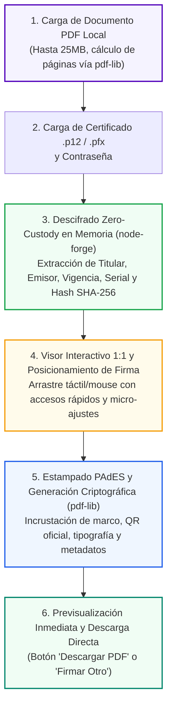
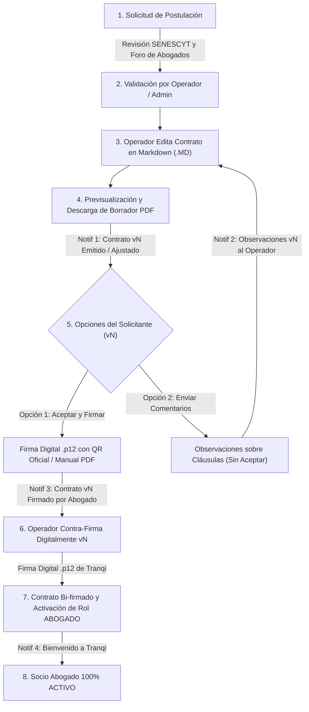
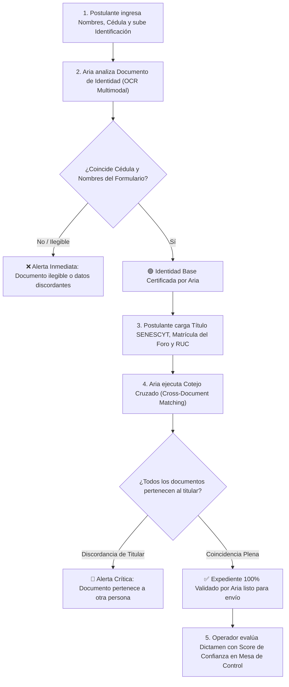

# Tranqi — Especificación Funcional (Red Legal & Legaltech)

**Prefijo de código de requerimiento:** `TRQ-xxx`  
**Esquema de Base de Datos:** `tranqui_legal` · **Prefijo de tablas:** `trq_`  
**Propietarios:** Tranqi Legal Network (Ecosistema Legaltech)

**Sistema visual:** [`sistema-visual.md`](sistema-visual.md) — paleta, uso del color por perfil (Cliente, Abogado, Operador/Administrador) y maquetas de referencia. Aplica a `tranqi-web` y aplicaciones móviles.

---

### Estándar de Referencia: Modelo Law Practice Management (LPMS) & Legal Marketplace

Tranqi adopta las mejores prácticas y estándares internacionales de **Law Practice Management Software (LPMS)** (referencias líderes de la industria como *Clio*, *MyCase*, *Smokeball* y *Lawmatics*), combinadas con un modelo marketplace digital (estilo *Uber para servicios legales* y *LegalZoom*), tropicalizadas al marco jurídico de la República del Ecuador (Código Orgánico de la Función Judicial, COGEP, SATJE, Ley de Comercio Electrónico y LOPDP).

#### Pilares de la Arquitectura Funcional:
1. **Billetera de Documentos Unificada (Universal Wallet):** Todo usuario (cliente, abogado, operador) dispone de una bóveda digital segura para gestionar documentos recurrentes, con capacidad de compartirlos a Tranqi para revisión puntual o vincularlos a expedientes de casos específicos.
2. **Expediente Digital Unificado (Matters & Cases):** Contenedor central que agrupa cliente, abogados asignados, escritos, documentos probatorios, etapas procesales y pagos.
3. **Despacho Jurídico Telemático para el Abogado:** Panel profesional con gestión de agenda, revisión de documentos compartidos por clientes, emisión de dictámenes y firma electrónica PAdES.
4. **Mesa de Control y Operaciones:** Supervisión de acreditaciones, asignación inteligente de causas y control de comisiones.

---

### Matriz de Responsables de Revisión, Implementación y Avance (%)

| Código | Rol / Ámbito | Funcionalidad / Requerimiento | Estado | Avance (%) | Responsable Asignado |
| :--- | :---: | :--- | :---: | :---: | :--- |
| **`TRQ-COM-001`** | **Común (Todos)** | **Billetera Digital de Documentos Seguros, Extracción OCR y Enlaces TTL** | ✅ Implementado | **100%** | Jesus Navarrete |
| **`TRQ-COM-002`** | **Común (Todos)** | **Compartición de Documentos a Tranqi (Revisión de Contratos & Vinculación a Casos)** | 🟡 Especificado | **25%** | Kleber Toapanta |
| **`TRQ-COM-003`** | **Común (Todos)** | **Herramienta Universal de Firma Digital de Documentos PDF (.p12 / QR / PAdES)** | ✅ Implementado | **100%** | Kleber Toapanta |
| **`TRQ-CLI-001`** | **Cliente** | **Portal de Casos, Solicitud de Patrocinio y Consultas Telemáticas** | 🟡 Parcial | **25%** | Jesus Navarrete / Kleber Toapanta |
| **`TRQ-CLI-002`** | **Cliente** | **Módulo Express de Revisión y Dictamen Legal de Contratos/Minutas (IA)** | ⏳ Pendiente | **0%** | **Jesus Navarrete (IA)** |
| **`TRQ-CLI-003`** | **Cliente** | **Directorio Público y Selección Geolocalizada de Abogados** | ✅ Implementado | **100%** | Kleber Toapanta |
| **`TRQ-CLI-004`** | **Cliente** | **Calculadora de Honorarios, Pensiones (MIES) e Indemnizaciones Laborales** | ⏳ Pendiente | **0%** | Jesus Navarrete |
| **`TRQ-ABG-001`** | **Abogado** | **Acreditación, Contratación Dual (Firma Digital .p12 / Manual) y Onboarding** | ✅ Implementado | **100%** | Kleber Toapanta |
| **`TRQ-ABG-002`** | **Abogado** | **Despacho Virtual: Bandeja de Casos, Expediente Digital y Actuaciones SATJE** | ⏳ Pendiente | **0%** | Kleber Toapanta / Jesus Navarrete |
| **`TRQ-ABG-003`** | **Abogado** | **Firma Electrónica Avanzada PAdES en Navegador (Zero-Custody `.p12`/`.pfx`)** | ✅ Implementado | **100%** | Kleber Toapanta |
| **`TRQ-ABG-004`** | **Abogado** | **Agenda Profesional, Citas Presenciales y Sala de Videoconsulta Segura** | 🟡 En Desarrollo | **35%** | Kleber Toapanta / Jesus Navarrete |
| **`TRQ-ABG-005`** | **Abogado** | **Verificación Inteligente de Identidad y Documentos con Aria (IA) en Registro de Abogados** | 🟡 Especificado | **25%** | **Jesus Navarrete (IA)** |
| **`TRQ-ADM-001`** | **Operador/Admin** | **Mesa de Control de Acreditación, Contra-Firma Tranqi y Activación de Socios** | ✅ Implementado | **100%** | Kleber Toapanta |
| **`TRQ-ADM-002`** | **Operador/Admin** | **Asignación Inteligente de Casos (IA), Liquidación de Honorarios y Comisiones** | ⏳ Pendiente | **0%** | **Jesus Navarrete (IA)** / Kleber Toapanta |
| **`TRQ-ADM-003`** | **Operador/Admin** | **Auditoría Transversal BDD, Telemetría API y Bitácora de Campañas** | ✅ Implementado | **100%** | Kleber Toapanta |

---

## 1. Módulos Comunes (Transversales a Todos los Roles)

### TRQ-COM-001 — Billetera Digital de Documentos Seguros, OCR y Enlaces Efímeros (TTL)
**Responsable:** Jesus Navarrete | **Estado:** ✅ Implementado (100%)

#### Descripción
Bóveda digital de documentos personales, familiares y profesionales donde cada usuario (cliente, socio abogado u operador) custodia archivos digitales de uso cotidiano con soporte multi-archivo (anverso/reverso/anexos), reconocimiento y extracción inteligente con el agente de IA **Aria**, gestión de alertas de caducidad configurables y generación de enlaces temporales protegidos (TTL).

#### Reglas de Negocio
1. **Composición Multi-Archivo por Documento (Formatos Restringidos):**
   - Un solo documento puede estar integrado por 1 o múltiples archivos adjuntos (ej. Anverso + Reverso de Cédula, Cédula + Certificado de Votación, Contrato + Anexos).
   - **Formatos permitidos estrictamente:** Únicamente **Imágenes (PNG, JPG, JPEG, WEBP)** o archivos **PDF** (hasta 25MB por archivo).
2. **Tipología y Categorías:**
   - *Personales / Familiares:* Cédulas de identidad (titular, cónyuge, cargas familiares/hijos), Licencia de Conducir, Pasaporte, Certificado de Votación.
   - *Vehiculares:* Matrícula vehicular, SOAT, Póliza de Seguro.
   - *Contratos y Servicios:* Contratos de arrendamiento, servicios residenciales (Internet, luz, agua), pólizas médicas.
   - *Profesionales / Corporativos:* Títulos universitarios, certificados de matrícula, nombramientos, RUC/RIMPE.
3. **Extracción y Metadatos Dinámicos Editables:**
   - Estructura de metadatos 100% dinámica (`clave: valor`) almacenada en JSONB (`doc_detalles.metadatos_dinamicos` y `doc_metadatos_ocr`).
   - El usuario puede editar la etiqueta del campo, editar el valor, eliminar campos existentes o añadir nuevos campos personalizados con `[+ Agregar Campo]`.
   - Asistido por **Aria IA** para sugerir y precargar parámetros automáticamente al analizar los archivos cargados.
   - *Flexibilidad Cero Fricción:* Ningún metadato es obligatorio; todos los campos son editables y opcionales. El formulario base solo requiere el título, tipo y categoría, con alerta de expiración activada por defecto.
4. **Motor de Alertas Proactivas de Caducidad Configurable:**
   - Conmutador para activar o desactivar alertas de vencimiento por documento (`doc_alertar_caducidad`, activo por defecto).
   - Tiempo de anticipación configurable: por defecto **3 meses antes (90 días)**, con opciones de 1 mes, 2 meses, 6 meses o 1 año.
   - Notificaciones multicanal (**In-App**, **Push** y **Email**) previas a la fecha de expiración.
5. **Compartición Externa mediante Enlaces Efímeros (TTL - Time-To-Live):**
   - El usuario puede compartir cualquier documento con terceros mediante URL temporal protegida por token criptográfico.
   - *Opciones de Expiración:* 1h, 3h, 6h, 12h, 24h, 3 días, 7 días, 30 días, *Una Sola Vista ("Burn on Read")* o fecha personalizada con clave PIN opcional.

---

### TRQ-COM-003 — Herramienta Universal de Firma Digital de Documentos PDF (.p12 / QR / PAdES)
**Responsable:** Kleber Toapanta | **Estado:** ✅ Implementado (100%)

#### Descripción
Widget modular universal (`firma_documentos_pdf`) y ruta directa (`/panel/firma-documentos`) que permite a cualquier usuario o rol del ecosistema firmar electrónicamente cualquier documento PDF local mediante su certificado digital (`.p12` o `.pfx`), estampando una firma visual oficial con código QR y metadatos PAdES conformes a la Ley de Comercio Electrónico del Ecuador.

#### Diagrama de Flujo Criptográfico y Experiencia de Usuario:



#### Reglas de Negocio y Estándares Técnicos:
1. **Privacidad Zero-Custody Absoluta:**
   - Ni el archivo `.p12`, ni la contraseña, ni el documento PDF son transmitidos a ningún servidor externo.
   - El descifrado ASN.1/PKCS#12 y la composición gráfica ocurren al 100% en la memoria RAM del navegador.
2. **Proyección Matemática de Coordenadas 1:1:**
   - La estampa visual mantiene una relación de aspecto fija (`230pt x 72pt`) proyectada matemáticamente desde el DOM porcentual hacia el sistema de coordenadas PDF de origen inferior-izquierdo:
     $$\text{xPdf} = \left(\frac{\text{posicionX}}{100}\right) \times \text{widthPage}$$
     $$\text{yPdf} = \text{heightPage} - \left(\frac{\text{posicionY}}{100}\right) \times \text{heightPage} - \text{boxHeight}$$
3. **Soporte Táctil Móvil Fluido:**
   - Eventos táctiles nativos (`touchmove`, `touchend`, `touchcancel`) con `touch-action: none` para prevenir colisiones con el scroll de la página.
4. **Disponibilidad Universal en Base de Datos:**
   - Registrado en `comun_seguridad.seg_widget` (`firma_documentos_pdf`) y asignado a todos los roles (`CLIENTE`, `ABOGADO`, `OPERADOR`, `ADMINISTRADOR`, `SUPERADMIN`) en `seg_rol_widget`.
   - Indexado en el buscador global (`BuscadorModulosGlobal`), catálogo superadmin (`ConsolaSuperAdminModular`) y matriz de perfiles (`AdministracionPerfilesWidget`).

---

### PLT-004 — Buddie Conversacional en el panel (asistentes Aria por perfil)
**Responsable:** **Jesus Navarrete (IA)** | **Estado:** ✅ Implementado (base)

#### Descripción
El requerimiento vive en la [especificación de Plataforma](../plataforma/especificacion-funcional.md);
aquí se registra cómo lo concreta Tranqi. Hasta ahora el único agente era el buddie
de venta de la landing pública, que no sabe quién lo lee. Ahora el panel autenticado
tiene un asistente que sí lo sabe, y es la base sobre la que operan **TRQ-CLI-002**,
**TRQ-ABG-005** y **TRQ-ADM-002**.

#### Reglas de Negocio
1. **Barra lateral, no burbuja flotante.** Tercera columna del panel, a la derecha del
   contenido, para que el usuario pueda leer su expediente mientras pregunta por él.
   Colapsa a pestaña por debajo de 1080 px. Toma el color del perfil de las mismas
   variables que el rail.
2. **Un agente por perfil.** `cliente` y `abogado` tienen agentes distintos en Aria, con
   herramientas distintas. Operador, técnico, administración y superadmin no tienen barra
   todavía: su asistente es TRQ-ADM-002.
3. **Historial persistido** en `trq_conversacion` / `trq_mensaje` (regla 3 de PLT-004). Un
   administrador **no** lee esas conversaciones: son consultas legales personales, y la
   visibilidad de oficio sería un problema de privacidad, no una comodidad de soporte.
4. **Las herramientas son servidores MCP** servidos por la propia `tranqi-web` y consumidos
   por Aria. La identidad del usuario viaja en una cápsula firmada, fuera del alcance del
   modelo, y toda consulta va bajo RLS — nunca `service_role`. Ver
   [ADR-0005](../../arquitectura/adr/0005-frontera-de-identidad-en-herramientas-de-ia.md).
5. **Consola de agentes** en `/panel/agentes`, solo `ADMINISTRADOR` y con MFA `aal2`: editar
   el prompt de un agente cambia lo que se le responde a todos los afiliados. Usa una key de
   *tenant* de Aria, que por diseño del backend no alcanza a ningún otro tenant.

#### Modelo de datos que aporta
`trq_caso_judicial`, `trq_cita`, `trq_documento_caso`, `trq_honorario`, `trq_conversacion`
y `trq_mensaje` (migración `20260823…_tranqui_legal_casos_y_asistente`). Son el cimiento
operativo que TRQ-CLI-002, TRQ-ABG-005 y TRQ-ADM-002 consultan; ver
[`especificacion-tecnica.md`](especificacion-tecnica.md).

---

## 2. Módulos para el Rol Cliente

### TRQ-CLI-001 — Portal de Casos, Solicitud de Patrocinio y Consultas Telemáticas
**Responsables:** Jesus Navarrete / Kleber Toapanta | **Estado:** 🟡 Parcial (25%)
- **Orientación y Consulta Telemática:** Atención de consultas preliminares asistidas por ARIA (`trq_consulta_rapida`), escalamiento a reserva de citas profesionales (`PLT-020` / `TRQ-ABG-004`) y acceso a salas de videoconsulta telemática segura.
- **Portal de Casos y Patrocinio Judicial (Pendiente):** Solicitud de patrocinio legal por materias, visualización de la línea de tiempo procesal del caso, abogados asignados, próximas audiencias y actuaciones procesales sincronizadas desde el SATJE.

### TRQ-CLI-002 — Módulo Express de Revisión de Contratos y Minutas
**Responsable:** Jesus Navarrete | **Estado:** ⏳ Pendiente (0%)
- Carga de contratos en Word/PDF desde la Billetera para revisión preventiva antes de la firma.
- Devolución del dictamen legal con semáforo de riesgo (cláusulas abusivas, penalidades, contingencias tributarias).

### TRQ-CLI-003 — Directorio Público de Abogados Verificados
**Responsable:** Kleber Toapanta | **Estado:** ✅ Implementado (100%)
- Carrusel público en la landing page (`/api/abogados-publicos`) y búsqueda por especialidad y provincia.

### TRQ-CLI-004 — Calculadora de Honorarios y Pensiones
**Responsable:** Jesus Navarrete | **Estado:** ⏳ Pendiente (0%)
- Simulador de pensiones alimenticias conforme a la tabla oficial del MIES / Consejo de la Judicatura y cálculo de liquidaciones laborales por despido intempestivo / desahucio.

---

## 3. Módulos para el Rol Abogado (Socio Profesional)

### TRQ-ABG-001 — Acreditación, Negociación de Contratos en Markdown (.MD) y Contratación Dual
**Responsable:** Kleber Toapanta | **Estado:** ✅ Implementado y Verificado (100%)

#### Ciclo de Vida de Acreditación, Negociación y Versionamiento de Contratos:



#### Reglas de Negociación, Edición y Versionamiento Inmutable:
1. **Edición Dinámica en Markdown (.MD) por Operador/Admin:**
   - El operador o administrador puede editar directamente las cláusulas del contrato en un editor Markdown (.MD) antes de emitir la versión `vN` al solicitante.
   - Cuenta con soporte de variables dinámicas interpoladas (`{{nombre_completo}}`, `{{cedula}}`).
   - Dispone de **Previsualización en tiempo real en PDF** y **Descarga del borrador vectorial en PDF** antes de aprobar y emitir la versión.
2. **Opciones Exclusivas del Postulante:**
   - **Opción 1 (Aceptar y Firmar Contrato vN):**
     - *Firma Electrónica en Línea (.p12 / .pfx):* Asistente interactivo en navegador (Zero-Custody) con posicionamiento visual libre, estampa de QR oficial ecuatoriano y descarga de copia firmada.
     - *Firma Manual / Escaneada (PDF):* Descarga del PDF oficial, firma física, escaneo y subida en PDF.
   - **Opción 2 (Enviar Comentarios / Observaciones sin Aceptar):**
     - El postulante formula observaciones específicas sobre cláusulas, guardadas inmutablemente y notificadas de inmediato al staff.
3. **Firma y Contra-Firma sobre la Última Versión Activa:**
   - Ambas partes firman y contra-firman siempre sobre la versión más reciente emitida (`v1`, `v2`, `v3`...).
4. **Trazabilidad Inmutable en Base de Datos (`trq_version_contrato_socio`):**
   - Registro inmutable de cada versión, autor, rol (`ADMINISTRADOR`, `OPERADOR`, `SOLICITANTE`), timestamp, motivo y archivo PDF bi-firmado.
5. **Notificaciones Bidireccionales Clarificadas por Fase:**
   - *Fase 1 (Emisión/Ajuste):* `📋 Contrato de Sociedad (Versión N) Emitido — Revisa y Firma` (Operador ➔ Solicitante).
   - *Fase 2A (Observaciones):* `💬 Observaciones al Contrato (Versión N) de {nombre}` (Solicitante ➔ Staff).
   - *Fase 2B (Firma del Abogado):* `📄 Contrato (Versión N) Firmado por el Abogado — Listo para Contra-Firma` (Solicitante ➔ Staff).
   - *Fase 3 (Contra-Firma y Activación):* `🎉 ¡Bienvenido a tranqi! Contrato Bi-firmado y Activación Exitosa` (Staff ➔ Solicitante).

---

### TRQ-ABG-002 — Despacho Virtual y Expediente Digital
**Responsable:** Kleber Toapanta / Jesus Navarrete | **Estado:** ⏳ Pendiente (0%)
- Bandeja de causas asignadas, acceso a los documentos compartidos por los clientes, gestor de escritos judiciales y bitácora de actuaciones.

---

### TRQ-ABG-003 — Firma Electrónica Avanzada PAdES en Navegador (Zero-Custody)
**Responsable:** Kleber Toapanta | **Estado:** ✅ Implementado y Verificado (100%)

#### Arquitectura de Criptografía sin Custodia en Servidor:
1. **Descifrado Local:** El navegador procesa el archivo `.p12`/`.pfx` mediante `node-forge` en memoria volátil (`ArrayBuffer`).
2. **Validación X.509:** Extracción en tiempo real del nombre del titular, cédula/RUC, entidad certificadora (Security Data, BCE, CJ, ANFAC, etc.), número de serie y período de validez.
3. **Estampa Visual PAdES:** Utilizando `pdf-lib`, se dibuja el recuadro oficial de firma con sello institucional, timestamp oficial de Ecuador (ECT), razón jurídica, número de serie y hash criptográfico SHA-256.
4. **Purga Inmediata de Memoria:** Las claves privadas y contraseñas se eliminan de la memoria inmediatamente tras generar el PDF firmado. **Nunca se transmiten por red ni se almacenan en servidores backend**.

---

### TRQ-ABG-004 — Agenda Profesional, Citas Presenciales y Sala de Videoconsulta Segura
**Responsables:** Kleber Toapanta / Jesus Navarrete | **Estado:** 🟡 En Desarrollo (35%)  
**Estándar de Plataforma:** [`PLT-020`](../plataforma/especificacion-funcional.md#plt-020--agenda-disponibilidad-citas-y-consulta-telemática) (Motor Común `comun_agenda` y `@eco/agenda`)

#### 1. Diagnóstico y Corrección de Vulnerabilidad Funcional en Producción
- **Falla detectada:** La herramienta actual del cliente `agendar_cita` (`apps/tranqi-web/modulos/asistente/herramientas-cliente.ts:180`) inserta registros en `tranqui_legal.trq_cita` omitiendo `cit_abogado_id` y `cit_fin_en`. Como la política RLS del abogado (`trq_cita_abogado_select`) filtra por su propio `cit_abogado_id`, **toda cita creada de este modo queda huérfana e invisible para cualquier abogado**.
- **Solución:** Se retira `agendar_cita` y se reemplaza por la herramienta transaccional `reservar_cita` apoyada en la función RPC `tranqui_legal.trq_fn_reservar_cita()`.
- **Blindaje RLS:** Se elimina la política `trq_cita_cliente_insert` que permitía al cliente insertar directamente por cliente Supabase sin validar franjas horarias ni anti-solape. Toda creación de cita exige invocar la función RPC transaccional.

#### 2. Modelo de Datos Especializado en `tranqui_legal`
Para articular con `comun_agenda` (PLT-020) y desacoplar la especialidad de la solicitud de acreditación original, se incorporan las siguientes entidades:

1. **Especialidades y Cobertura Territorial (N:M independientes):**
   - `trq_abogado_materia`: `amt_abogado_id` (FK `trq_abogado`), `amt_materia_id` (FK `trq_materia`).
   - `trq_abogado_provincia`: `apr_abogado_id` (FK `trq_abogado`), `apr_provincia_id` (FK `cat_provincia`).
   - *Backfill automático:* Se migran inicialmente desde `trq_solicitud_materia` y `trq_solicitud_provincia` de las solicitudes aprobadas, permitiendo al abogado actualizar su catálogo sin alterar la solicitud histórica.
2. **Ampliación Aditiva de `tranqui_legal.trq_cita`:**
   - `cit_reserva_id uuid references comun_agenda.age_reserva(res_id)`: Enlace al motor de ocupación y anti-solape (`btree_gist`).
   - `cit_tipo_cita_id uuid references comun_agenda.age_tipo_cita(tci_id)`: Enlace al tipo de consulta.
   - `cit_origen text check (cit_origen in ('panel', 'asistente', 'operador', 'escalado_rapida'))`.
   - `cit_sala_nombre text`, `cit_sala_expira_en timestamptz`: Parámetros de la sala de videoconsulta.
   - `cit_confirmada_en timestamptz`.
   - `cit_cancelada_por uuid references comun_seguridad.seg_usuario(usu_id)`.
   - `cit_modalidad_cobro text check (cit_modalidad_cobro in ('no_aplica', 'cubierto_por_plan', 'cupon_gratis', 'pagada_pasarela'))`.
   - `cit_recordatorio_24h_enviado timestamptz`, `cit_recordatorio_1h_enviado timestamptz`: Control idempotente para el despachador de alertas agnóstico (Vercel / Linux propio).
3. **Tipos de Cita en Tranqi (`age_tipo_cita`):**
   - En lugar de desvirtuar el catálogo canónico de 12 materias del Código Orgánico de la Función Judicial (Civil, Penal, Familia y Niñez, Laboral, etc.) con términos coloquiales como "Divorcio" o "Conciliación" (que corresponden a figuras jurídicas o métodos MASC transversales), se parametrizan como tipos de cita de Tranqi vinculados a su materia rectora:
     * `divorcio_mutuo_acuerdo` (Materia: Familia y Niñez, 45 min).
     * `conciliacion_extrajudicial` (Materia: Civil / Familia, 60 min).
     * `accidente_transito` (Materia: Tránsito, 45 min).
     * `orientacion_15` (Orientación inicial breve, 15 min).
     * `especialista_45` (Consulta de patrocinio formal, 45 min).

#### 3. Consulta Rápida con ARIA y Escalado (`trq_consulta_rapida`)
- Tabla `trq_consulta_rapida`:
  - `crp_id uuid primary key default gen_random_uuid()`.
  - `crp_usuario_id uuid references comun_seguridad.seg_usuario(usu_id)`.
  - `crp_conversacion_id uuid references tranqui_legal.trq_conversacion(cnv_id)`.
  - `crp_pregunta text not null`, `crp_materia_sugerida_id uuid`, `crp_tipo_cita_sugerido_id uuid`.
  - `crp_resuelta boolean default false`.
  - `crp_escalada_en timestamptz`, `crp_cita_id uuid references tranqui_legal.trq_cita(cit_id)`.
- **Frontera Ética en el Prompt de ARIA:** ARIA orienta al ciudadano en lenguaje simple y pedagógico, pero **no patrocina ni asegura resultados judiciales**. Cuando el asunto implica plazos de prescripción, revisión de pruebas o demanda formal, ARIA emite el bloque interactivo `tranqi:opciones` en la barra del chat para que el cliente escoja un especialista y reserve una cita.

#### 4. Opciones Estructuradas en Chat (`BarraAsistente.tsx`)
El asistente no solo responde texto plano, sino que puede emitir bloques interactivos estructurados:
````
```tranqi:opciones
{
  "pregunta": "¿Cuál horario prefieres para tu consulta?",
  "opciones": [
    { "id": "slot_uuid_1", "titulo": "Dra. Paula Andrade", "detalle": "Familia · Martes 10:00 · Virtual" },
    { "id": "slot_uuid_2", "titulo": "Dr. Fernando Mora", "detalle": "Familia · Martes 15:30 · Virtual" }
  ],
  "permite_texto_libre": true
}
```
````
La barra renderiza tarjetas seleccionables que inyectan la respuesta del cliente de forma fluida y transparente para el LLM.

#### 5. Onboarding Conversacional de Disponibilidad del Abogado
- Cuando un abogado accede a su panel y su agenda no está configurada (`agp_configurada_en is null`), ARIA inicia un diálogo de onboarding guiado:
  * Pregunta días laborales, franjas horarias, duración estimada y modalidad (virtual / presencial en despacho).
  * Solicita confirmación explícita con un resumen claro antes de invocar `age_fn_configurar_agenda()`. Nunca escribe disponibilidad sin la confirmación del profesional.

#### 6. Videoconsulta Telemática Segura (Jitsi Meet)
- El sistema genera un identificador de sala único e impredecible (`gen_random_uuid()`) que no revela identificadores de caso ni nombres de las partes.
- La URL oficial solo se suministra a usuarios autorizados por RLS en la ventana temporal activa: **desde 10 minutos antes hasta 30 minutos después** de la cita.

#### 7. Agendamiento y Modificación Manual por Operadores de Tranqi
Para brindar soporte integral a clientes corporativos, personas de la tercera edad o casos asistidos por la Mesa de Control:
- **Agendamiento Manual Asistido:** Los roles `OPERADOR`, `ADMINISTRADOR` y `SUPERADMIN` disponen de una acción en su panel para agendar citas directamente:
  * Buscador interactivo de clientes (`seg_usuario`) por cédula/RUC, correo o nombres.
  * Selector de socio abogado habilitado (`trq_abogado`), con visualización de materias y disponibilidad.
  * Definición de fecha, hora, modalidad y motivo, registrándose con `cit_origen = 'operador'`.
- **Modificación Manual de Citas:**
  * El operador puede reprogramar la fecha/hora o reasignar el abogado titular ante contingencias médicas o audiencias sobrevenidas del profesional.
  * Esta acción opera con independencia del cupo de reagendamientos del cliente, requiriendo motivo justificado en `comun_auditoria.aud_registro` y notificando en tiempo real a cliente y abogado.

#### 8. Política de Cancelaciones, Reagendamientos y Aceptación Obligatoria
Implementación estricta de la [`politica-cancelacion-reagendamiento-citas.md`](../../politicas/politica-cancelacion-reagendamiento-citas.md):
- **Parámetros Operativos de Tranqi:**
  * **Límite de Reagendamientos ($N$):** Máximo **1 reagendamiento** por cita (`cit_reagendamientos_restantes = 1` por defecto).
  * **REGLA ESTRICTA DE GRATUIDAD / CUPONES:** Toda consulta gratuita, de cortesía o cubierta al 100% por cupón promocional (`CUPON_GRATIS`, `PRIMERA_CITA`) **NO ADMITE REAGENDAMIENTO**. Si el cliente cancela o no asiste, el beneficio se considera consumido y el cupón expira.
  * **Antelación Mínima ($X$ horas):** Mínimo **12 horas** antes de la hora pactada para cancelar o reagendar con derecho a reembolso.
  * **Porcentaje de Reembolso Oportuno ($X\%$):** **80% de reembolso** acreditado a Billetera o pasarela Payphone (el 20% cubre costos de pasarela y reserva de agenda). Cancelaciones con menos de 12 horas o inasistencia (*No-Show* tras 15 minutos de espera): **0% de reembolso**.
- **Aceptación Contractual Obligatoria del Cliente:**
  * Previo a confirmar el pago en la web o acordar la cita con ARIA, el cliente debe marcar la casilla obligatoria: *"Acepto la Política de Cancelación y Reagendamiento (Máx. 1 cambio con 12h de antelación; citas gratuitas no admiten cambio)"*.
  * La base de datos almacena inmutablemente `cit_politica_aceptada_en` (timestamp) y `cit_politica_version` (ej. `'v1.0-2026-09'`).

---

### TRQ-ABG-005 — Verificación Inteligente de Identidad y Documentos con Aria (IA) en Registro de Abogados
**Responsable:** **Jesus Navarrete (IA)** | **Estado:** 🟡 Especificado (25%)

#### 1. Descripción & Objetivos de Negocio
Integración del agente de IA multimodal **Aria** (`packages/agentes-ia`) en el flujo de postulación y registro de socios abogados (`/panel/solicitud-socio`). Aria valida en tiempo real la legibilidad y coherencia de la Cédula de Identidad/Pasaporte y ejecuta un **cotejo cruzado inmutable (Cross-Document Verification)** para certificar que el 100% de los documentos adjuntos (Título Universitario SENESCYT, Carnet del Foro de Abogados, RUC, Certificados) pertenezcan legítimamente a la misma persona registrada, previniendo suplantaciones y reduciendo la carga de auditoría humana en la Mesa de Control.

#### 2. Diagrama de Flujo de Inspección Inteligente de Identidad:



#### 3. Reglas de Negocio Estrictas:
1. **Extracción y Validación de Identidad Base:**
   - Aria extrae nombres, apellidos, número de identificación y fecha de caducidad de la cédula o pasaporte.
   - Si la similitud con los datos del formulario es `< 90%` o el Módulo 10 es inconsistente, se bloquea el avance con alerta explicativa.
2. **Cotejo Cruzado de Titularidad Única (Cross-Document Matching):**
   - Aria compara el titular extraído del Título SENESCYT, Matrícula del Foro de Abogados y RUC contra la Identidad Base validada.
   - Si se detecta un titular ajeno, se emite una alerta roja inmediata impidiendo el envío fraudulento.
3. **Semáforo de Confianza de Aria:**
   - 🟢 **90% - 100% (Aprobado):** Coincidencia plena.
   - 🟡 **70% - 89% (Observación):** Variación leve en nombres para revisión del operador.
   - 🔴 **< 70% (Rechazado):** Discrepancia crítica o documento ilegible.
4. **Persistencia e Inmutabilidad en Base de Datos:**
   - El dictamen de Aria se almacena en `tranqui_legal.trq_solicitud_socio.ssc_detalles` (`aria_validacion: { estado, score, documentos_auditados }`) y en `comun_auditoria.aud_registro`.

#### 4. Criterios de Aceptación (Gherkin):

```gherkin
Escenario: Validación exitosa de cédula concordante con el formulario
  Dado que el postulante ingresó "1719103986" y "Carlos Alberto Pérez Mena"
  Cuando sube la fotografía de su Cédula de Identidad en formato JPG
  Entonces Aria analiza la imagen en menos de 3 segundos
  Y muestra un distintivo verde: "✨ Identidad Validada por Aria: Carlos Alberto Pérez Mena (1719103986)"
  Y habilita la carga de los siguientes documentos probatorios.

Escenario: Detección de documento de título perteneciente a otra persona
  Dado que la Identidad Base validada pertenece a "Carlos Alberto Pérez Mena (1719103986)"
  Cuando el postulante sube un Título Universitario perteneciente a "María Fernanda López (1712345678)"
  Entonces Aria detecta la discrepancia de titular
  Y despliega una alerta: "⚠️ El documento cargado pertenece a María Fernanda López y no coincide con tu identidad"
  Y solicita volver a subir el documento correcto antes de permitir el envío.

Escenario: Mesa de Control con Dictamen de Aria para el Operador
  Dado que un operador ingresa a "/panel/socios" para evaluar una postulación
  Cuando abre el expediente del postulante
  Entonces visualiza la tarjeta "Inspección de Identidad Aria" con el desglose de similitud (100%), datos extraídos de cada documento y recomendación de aprobación directa.
```

#### 5. Contrato de API & Integración Técnica:
- **Endpoint:** `POST /api/agentes/aria-verificacion-identidad`
- **Request:** `{ usuarioId, tipoDocumento, archivoBase64, archivoNombre, datosReferencia: { nombres, apellidos, cedula } }`
- **Response:** `{ ok: true, data: { resultado: "APROBADO" | "OBSERVACION" | "RECHAZADO", scoreConfianza: number, datosExtraidos, concordancia, observaciones } }`

---

## 4. Módulos para el Rol Operador y Administrador

### TRQ-ADM-001 — Mesa de Control de Acreditación, Contra-Firma Tranqi y Activación
**Responsable:** Kleber Toapanta | **Estado:** ✅ Implementado y Verificado (100%)

- Panel de evaluación de solicitudes (`/panel/socios` y `/panel/administrar`), validación de títulos SENESCYT y matrículas del Foro de Abogados, con exigencia estricta de MFA TOTP (`aal2`).
- **Módulo de Contra-Firma Digital Institucional:** El operador/administrador visualiza el contrato firmado por el abogado y ejecuta la contra-firma digital de Tranqi con certificado `.p12` institucional, generando el **Contrato Bi-firmado oficial**.
- **Activación Inmediata de Credenciales:** Al completar la contra-firma, se actualiza el registro en `trq_abogado`, se asigna el perfil `ABOGADO` en `seg_membresia_perfil` y se despacha la notificación formal de bienvenida.
- **Indicadores Contextuales de la Tabla de Socios:**
  - `🎉 Contrato Bi-firmado` ➔ Botón `Ver Expediente`.
  - `📄 Contrato Listo para Contra-firma` ➔ Botón `Contra-firmar y Activar`.
  - `📝 Propuesta Word (N)` ➔ Botón `Revisar Propuesta`.
  - `✍️ Esperando Firma del Abogado` ➔ Estado en espera.
  - `⏳ Postulación Inicial` ➔ Botón `Evaluar`.
- **Notificaciones Automáticas Multicanal (In-App, Push y Email):**
  - *Fase 1:* `📋 ¡Credenciales Validadas! — Descarga y Firma tu Contrato de Sociedad`.
  - *Fase 2:* `📄 Contrato Firmado Recibido — Listo para Verificación y Contra-Firma`.
  - *Fase 3:* `🎉 ¡Bienvenido a tranqi! Contrato Bi-firmado y Cuenta de Socio Abogado Activada`.

### TRQ-ADM-002 — Asignación de Casos y Liquidación de Honorarios
**Responsable:** Kleber Toapanta / Jesus Navarrete | **Estado:** ⏳ Pendiente (0%)
- Ruteo inteligente de causas a abogados según especialidad, carga procesal y provincia.
- Liquidación periódica de honorarios deduciendo la comisión de intermediación de la plataforma.

### TRQ-ADM-003 — Auditoría Transversal BDD y Telemetría
**Responsable:** Kleber Toapanta | **Estado:** ✅ Implementado (100%)
- Tablero DataGrid de auditoría en `/panel/auditoria` con trazabilidad Antes/Después por triggers en `comun_auditoria.aud_registro`.
