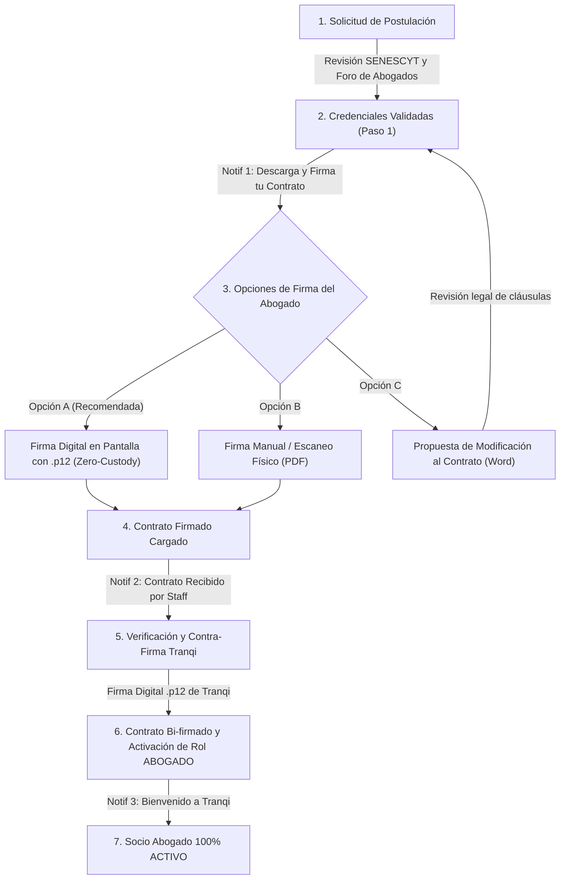

# Tranqi — Especificación Funcional (Red Legal & Legaltech)

**Prefijo de código de requerimiento:** `TRQ-xxx`  
**Esquema de Base de Datos:** `tranqui_legal` · **Prefijo de tablas:** `trq_`  
**Propietarios:** Tranqi Legal Network (Ecosistema Legaltech)

**Sistema visual:** [`sistema-visual.md`](sistema-visual.md) — paleta, uso del color por perfil (Cliente, Abogado, Operador/Administrador) y maquetas de referencia. Aplica a `tranqi-web` y aplicaciones móviles.

---

### Estándar de Referencia: Modelo Law Practice Management (LPMS) & Legal Marketplace

Tranqi adopta las mejores prácticas y estándares internacionales de **Law Practice Management Software (LPMS)** (referencias líderes de la industria como *Clio*, *MyCase*, *Smokeball* y *Lawmatics*), combinadas con un modelo marketplace digital (estilo *Uber para servicios legales* y *LegalZoom*), tropicalizadas al marco jurídico de la República del Ecuador (Código Orgánico de la Función Judicial, COGEP, SATJE, Ley de Comercio Electrónico y LOPDP).

#### Pilares de la Arquitectura Funcional:
1. **Billetera de Documentos Unificada (Universal Wallet):** Todo usuario (cliente, abogado, operador) dispone de una bóveda digital segura para gestionar documentos recurrentes, con capacidad de compartirlos a Tranqi para revisión puntual o vincularlos a expedientes de casos específicos.
2. **Expediente Digital Unificado (Matters & Cases):** Contenedor central que agrupa cliente, abogados asignados, escritos, documentos probatorios, etapas procesales y pagos.
3. **Despacho Jurídico Telemático para el Abogado:** Panel profesional con gestión de agenda, revisión de documentos compartidos por clientes, emisión de dictámenes y firma electrónica PAdES.
4. **Mesa de Control y Operaciones:** Supervisión de acreditaciones, asignación inteligente de causas y control de comisiones.

---

### Matriz de Responsables de Revisión, Implementación y Avance (%)

| Código | Rol / Ámbito | Funcionalidad / Requerimiento | Estado | Avance (%) | Responsable Asignado |
| :--- | :---: | :--- | :---: | :---: | :--- |
| **`TRQ-COM-001`** | **Común (Todos)** | **Billetera Digital de Documentos Seguros, Extracción OCR y Enlaces TTL** | 🟡 Especificado | **30%** | Kleber Toapanta |
| **`TRQ-COM-002`** | **Común (Todos)** | **Compartición de Documentos a Tranqi (Revisión de Contratos & Vinculación a Casos)** | 🟡 Especificado | **25%** | Kleber Toapanta |
| **`TRQ-CLI-001`** | **Cliente** | **Portal de Casos, Solicitud de Patrocinio y Consultas Telemáticas** | ⏳ Pendiente | **0%** | Jesus Navarrete |
| **`TRQ-CLI-002`** | **Cliente** | **Módulo Express de Revisión y Dictamen Legal de Contratos/Minutas** | ⏳ Pendiente | **0%** | Jesus Navarrete |
| **`TRQ-CLI-003`** | **Cliente** | **Directorio Público y Selección Geolocalizada de Abogados** | ✅ Implementado | **100%** | Kleber Toapanta |
| **`TRQ-CLI-004`** | **Cliente** | **Calculadora de Honorarios, Pensiones (MIES) e Indemnizaciones Laborales** | ⏳ Pendiente | **0%** | Jesus Navarrete |
| **`TRQ-ABG-001`** | **Abogado** | **Acreditación, Contratación Dual (Firma Digital .p12 / Manual) y Onboarding** | ✅ Implementado | **100%** | Kleber Toapanta |
| **`TRQ-ABG-002`** | **Abogado** | **Despacho Virtual: Bandeja de Casos, Expediente Digital y Actuaciones SATJE** | ⏳ Pendiente | **0%** | Kleber Toapanta / Jesus Navarrete |
| **`TRQ-ABG-003`** | **Abogado** | **Firma Electrónica Avanzada PAdES en Navegador (Zero-Custody `.p12`/`.pfx`)** | ✅ Implementado | **100%** | Kleber Toapanta |
| **`TRQ-ABG-004`** | **Abogado** | **Agenda Profesional, Citas Presenciales y Sala de Videoconsulta Segura** | ⏳ Pendiente | **0%** | Jesus Navarrete |
| **`TRQ-ADM-001`** | **Operador/Admin** | **Mesa de Control de Acreditación, Contra-Firma Tranqi y Activación de Socios** | ✅ Implementado | **100%** | Kleber Toapanta |
| **`TRQ-ADM-002`** | **Operador/Admin** | **Asignación de Casos, Liquidación de Honorarios y Comisión de Plataforma** | ⏳ Pendiente | **0%** | Kleber Toapanta / Jesus Navarrete |
| **`TRQ-ADM-003`** | **Operador/Admin** | **Auditoría Transversal BDD, Telemetría API y Bitácora de Campañas** | ✅ Implementado | **100%** | Kleber Toapanta |

---

## 1. Módulos Comunes (Transversales a Todos los Roles)

### TRQ-COM-001 — Billetera Digital de Documentos Seguros, OCR y Enlaces Efímeros (TTL)
**Responsable:** Kleber Toapanta | **Estado:** 🟡 Especificado (30%)

#### Descripción
Bóveda digital de documentos personales, familiares y profesionales donde cada usuario (cliente, socio abogado u operador) custodia archivos digitales de uso cotidiano con reconocimiento OCR de parámetros clave y generación de enlaces temporales protegidos.

#### Reglas de Negocio
1. **Tipología de Documentos:**
   - *Personales / Familiares:* Cédulas de identidad (titular, cónyuge, cargas familiares/hijos), Licencia de Conducir, Pasaporte, Certificado de Votación.
   - *Vehiculares:* Matrícula vehicular, SOAT, Póliza de Seguro.
   - *Contratos y Servicios:* Contratos de arrendamiento, contratos de servicios residenciales (Internet, luz, agua), pólizas médicas.
   - *Profesionales / Corporativos:* Títulos universitarios, certificados de matrícula, nombramientos, RUC/RIMPE.
2. **Almacenamiento Estructurado y Cifrado:**
   - Ubicación: `comun-privado/TRANQ/{usuario_id}/billetera-documentos/{categoria}/{doc_id}-{nombre_sanitizado}`.
   - Acceso restringido por RLS y cifrado de metadatos sensibles.
3. **Extracción Inteligente de Parámetros (OCR):**
   - Lectura automática de: Nombres completos, Cédula/RUC, Fecha de Emisión, Fecha de Caducidad/Expiración y Entidad Emisora.
4. **Motor de Alertas Proactivas de Caducidad:**
   - Notificaciones automáticas multicanal (**In-App**, **Push** y **Email**) a los **30 días, 15 días y 7 días previos** al vencimiento de licencias, pólizas, matrículas o contratos.
5. **Compartición Externa mediante Enlaces Efímeros (TTL - Time-To-Live):**
   - El usuario puede compartir cualquier documento con terceros mediante URL temporal protegida por token criptográfico.
   - *Opciones de Expiración:* 1h, 3h, 6h, 12h, 24h, 3 días, 7 días, 30 días, *Una Sola Vista ("Burn on Read")* o fecha personalizada con clave PIN opcional.

---

### TRQ-COM-002 — Compartición de Documentos a Tranqi (Revisión Legal & Vinculación a Casos)
**Responsable:** Kleber Toapanta | **Estado:** 🟡 Especificado (25%)

#### Descripción
Capacidad para que el usuario comparta cualquier documento de su Billetera Digital hacia la plataforma Tranqi con dos propósitos clave:
1. **Compartición a un Caso / Trámite (`Por Caso`):** El documento se vincula como pieza procesal al expediente judicial de un trámite específico, accesible de forma permanente por los abogados patrocinadores asignados a dicha causa.
2. **Compartición Permanente a su Abogado de Cabecera (`Permanente`):** El cliente otorga acceso continuado a ciertos documentos esenciales (ej. cédulas familiares, nombramiento de empresa) para asistencia legal recurrente.
3. **Envío a Revisión Express de Contratos:** El cliente envía una minuta o contrato para que el equipo legal de Tranqi emita un dictamen jurídico con control de cambios y recomendaciones de cláusulas de riesgo.

---

## 2. Módulos para el Rol Cliente

### TRQ-CLI-001 — Portal de Casos y Patrocinio Judicial
**Responsable:** Jesus Navarrete | **Estado:** ⏳ Pendiente (0%)
- Solicitud de patrocinio legal por materias (Civil, Penal, Laboral, Familia, Tránsito, Societario).
- Visualización de la línea de tiempo procesal del caso, abogados asignados, próximas audiencias y actuaciones procesales del SATJE.

### TRQ-CLI-002 — Módulo Express de Revisión de Contratos y Minutas
**Responsable:** Jesus Navarrete | **Estado:** ⏳ Pendiente (0%)
- Carga de contratos en Word/PDF desde la Billetera para revisión preventiva antes de la firma.
- Devolución del dictamen legal con semáforo de riesgo (cláusulas abusivas, penalidades, contingencias tributarias).

### TRQ-CLI-003 — Directorio Público de Abogados Verificados
**Responsable:** Kleber Toapanta | **Estado:** ✅ Implementado (100%)
- Carrusel público en la landing page (`/api/abogados-publicos`) y búsqueda por especialidad y provincia.

### TRQ-CLI-004 — Calculadora de Honorarios y Pensiones
**Responsable:** Jesus Navarrete | **Estado:** ⏳ Pendiente (0%)
- Simulador de pensiones alimenticias conforme a la tabla oficial del MIES / Consejo de la Judicatura y cálculo de liquidaciones laborales por despido intempestivo / desahucio.

---

## 3. Módulos para el Rol Abogado (Socio Profesional)

### TRQ-ABG-001 — Acreditación, Contratación Dual y Onboarding de Socio Abogado
**Responsable:** Kleber Toapanta | **Estado:** ✅ Implementado y Verificado (100%)

#### Ciclo de Vida de Acreditación y Contratación:

#### Reglas de Contratación, Formatos y Trazabilidad:
1. **Opciones Duales de Firma para el Postulante:**
   - **Opción A (Firma Electrónica en Línea `.p12`/`.pfx`):** Asistente interactivo en navegador donde el usuario carga su archivo `.p12` e ingresa su contraseña en memoria (Zero-Custody). El sistema estampa el recuadro visual de firma PAdES en el PDF y lo envía automáticamente.
   - **Opción B (Firma Manual / Externa):** Descarga el contrato pre-llenado en PDF o Word, lo firma de forma manuscrita o con FirmaEC, y sube el PDF firmado.
   - **Opción C (Propuesta de Modificación Word `.docx`):** Envío de observaciones a cláusulas con motivo justificado (mínimo 5 caracteres), con gestión de versiones para no bloquear la cola de socios.
2. **Firma y Aprobación Definitiva (Exclusivamente PDF):**
   - Para la formalización y activación final del socio se admite **únicamente el formato PDF (`.pdf`)** con la firma manuscrita o electrónica del abogado.
3. **Versionamiento Inmutable del Intercambio (Modelo Contract Lifecycle Management - CLM):**
   - Versionamiento inmutable en Base de Datos (`trq_documento_socio` + `trq_revision_solicitud`), registrando versiones consecutivas (`v1`, `v2`, `v3`...), autor, rol, timestamp, archivo binario y motivos.

---

### TRQ-ABG-002 — Despacho Virtual y Expediente Digital
**Responsable:** Kleber Toapanta / Jesus Navarrete | **Estado:** ⏳ Pendiente (0%)
- Bandeja de causas asignadas, acceso a los documentos compartidos por los clientes, gestor de escritos judiciales y bitácora de actuaciones.

---

### TRQ-ABG-003 — Firma Electrónica Avanzada PAdES en Navegador (Zero-Custody)
**Responsable:** Kleber Toapanta | **Estado:** ✅ Implementado y Verificado (100%)

#### Arquitectura de Criptografía sin Custodia en Servidor:
1. **Descifrado Local:** El navegador procesa el archivo `.p12`/`.pfx` mediante `node-forge` en memoria volátil (`ArrayBuffer`).
2. **Validación X.509:** Extracción en tiempo real del nombre del titular, cédula/RUC, entidad certificadora (Security Data, BCE, CJ, ANFAC, etc.), número de serie y período de validez.
3. **Estampa Visual PAdES:** Utilizando `pdf-lib`, se dibuja el recuadro oficial de firma con sello institucional, timestamp oficial de Ecuador (ECT), razón jurídica, número de serie y hash criptográfico SHA-256.
4. **Purga Inmediata de Memoria:** Las claves privadas y contraseñas se eliminan de la memoria inmediatamente tras generar el PDF firmado. **Nunca se transmiten por red ni se almacenan en servidores backend**.

---

### TRQ-ABG-004 — Agenda Profesional y Videoconsultas
**Responsable:** Jesus Navarrete | **Estado:** ⏳ Pendiente (0%)
- Calendario sincronizado de citas presenciales en despacho y salas de consulta telemática segura.

---

## 4. Módulos para el Rol Operador y Administrador

### TRQ-ADM-001 — Mesa de Control de Acreditación, Contra-Firma Tranqi y Activación
**Responsable:** Kleber Toapanta | **Estado:** ✅ Implementado y Verificado (100%)

- Panel de evaluación de solicitudes (`/panel/socios` y `/panel/administrar`), validación de títulos SENESCYT y matrículas del Foro de Abogados, con exigencia estricta de MFA TOTP (`aal2`).
- **Módulo de Contra-Firma Digital Institucional:** El operador/administrador visualiza el contrato firmado por el abogado y ejecuta la contra-firma digital de Tranqi con certificado `.p12` institucional, generando el **Contrato Bi-firmado oficial**.
- **Activación Inmediata de Credenciales:** Al completar la contra-firma, se actualiza el registro en `trq_abogado`, se asigna el perfil `ABOGADO` en `seg_membresia_perfil` y se despacha la notificación formal de bienvenida.
- **Indicadores Contextuales de la Tabla de Socios:**
  - `🎉 Contrato Bi-firmado` ➔ Botón `Ver Expediente`.
  - `📄 Contrato Listo para Contra-firma` ➔ Botón `Contra-firmar y Activar`.
  - `📝 Propuesta Word (N)` ➔ Botón `Revisar Propuesta`.
  - `✍️ Esperando Firma del Abogado` ➔ Estado en espera.
  - `⏳ Postulación Inicial` ➔ Botón `Evaluar`.
- **Notificaciones Automáticas Multicanal (In-App, Push y Email):**
  - *Fase 1:* `📋 ¡Credenciales Validadas! — Descarga y Firma tu Contrato de Sociedad`.
  - *Fase 2:* `📄 Contrato Firmado Recibido — Listo para Verificación y Contra-Firma`.
  - *Fase 3:* `🎉 ¡Bienvenido a tranqi! Contrato Bi-firmado y Cuenta de Socio Abogado Activada`.

### TRQ-ADM-002 — Asignación de Casos y Liquidación de Honorarios
**Responsable:** Kleber Toapanta / Jesus Navarrete | **Estado:** ⏳ Pendiente (0%)
- Ruteo inteligente de causas a abogados según especialidad, carga procesal y provincia.
- Liquidación periódica de honorarios deduciendo la comisión de intermediación de la plataforma.

### TRQ-ADM-003 — Auditoría Transversal BDD y Telemetría
**Responsable:** Kleber Toapanta | **Estado:** ✅ Implementado (100%)
- Tablero DataGrid de auditoría en `/panel/auditoria` con trazabilidad Antes/Después por triggers en `comun_auditoria.aud_registro`.
