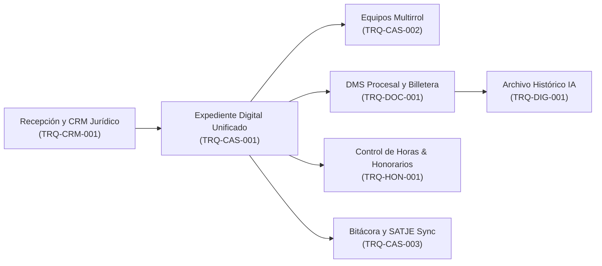

# Glosario Técnico y de Términos — Tranqi (Red Legal & Legaltech)

**Aplicación:** `apps/tranqi-web` · **Esquema BDD:** `tranqui_legal` · **Prefijo de tablas:** `trq_`  
**Ubicación:** `gobernanza/productos/tranqi/glosario-tranqi.md`  

---

## 1. Módulos y Dominio Legaltech (LPMS)

| Sigla / Término | Categoría | Explicación y Aplicación en Tranqi |
| :--- | :--- | :--- |
| **LPMS** | Dominio | *Law Practice Management Software*: Sistema integral para administrar expedientes, clientes, audiencias, honorarios y tiempos en un despacho jurídico. |
| **Expediente Digital (*Matter*)** | Producto | Contenedor central (`trq_caso_judicial`) identificado como `TRQ-MAT-YYYY-XXXXX` que agrupa al cliente, equipo legal, carpetas procesales, bitácora y cobros. |
| **Trámite Judicial vs. Extrajudicial** | Dominio | • *Judicial:* Litigios contenciosos y voluntarios ante juzgados y tribunales (SATJE / COGEP). • *Extrajudicial:* Minutas notariales, constitución de compañías SAS, registro de marcas SENADI, contratos y mediación MASC. |
| **SATJE** | Integración | *Sistema Automático de Trámite Judicial del Ecuador*: Plataforma oficial del Consejo de la Judicatura para consulta de causas y providencias. |
| **COGEP / COIP** | Legal | *Código Orgánico General de Procesos* / *Código Orgánico Integral Penal*: Códigos procesales rectores en Ecuador que determinan los términos y audiencias. |
| **Término Legal Perentorio** | Legal | Plazo procesal en días hábiles judiciales (ej. 3 días para recurso de apelación, 30 días para contestación a la demanda ordinaria) monitoreado en `trq_caso_actuacion`. |
| **Conflict Check** | CRM Legal | *Verificación de Conflicto de Intereses*: Consulta previa automática para certificar que la contraparte en un litigio no está siendo patrocinada por abogados de la red. |
| **Persona Natural vs. Jurídica** | CRM Legal | • *Natural:* Cédula ecuatoriana / Pasaporte, estado civil y domicilio judicial. • *Jurídica:* RUC corporativo (13 dígitos), razón social, objeto social y vinculación del Representante Legal. |

---

## 2. Gestión Documental, Criptografía y Firma Electrónica

| Sigla / Término | Categoría | Explicación y Aplicación en Tranqi |
| :--- | :--- | :--- |
| **PAdES (.p12 / .pfx)** | Criptografía | Estándar oficial de firma electrónica PDF en Ecuador que estampa código QR, timestamp y certificado digital X.509 conforme a la Ley de Comercio Electrónico. |
| **Billetera de Documentos** | Producto | Bóveda digital segura (`TRQ-COM-001`) donde cada usuario custodia cédulas, nombramientos y contratos para vincularlos a expedientes sin volver a subirlos. |
| **5 Carpetas Procesales Estándar** | DMS Legal | Estructura predeterminada por expediente: *01. Poderes*, *02. Pruebas*, *03. Escritos*, *04. Providencias*, *05. Facturación*. |
| **Versionamiento Inmutable (`vN`)** | DMS Legal | Histórico inmutable de versiones sucesivas (`v1`, `v2`, `v3`...) para minutas, contratos y demandas en borrador. |
| **Ficha Sinóptica Ejecutiva** | IA ARIA | Resumen de 1 página generado por ARIA que sintetiza el estado procesal, partes, juez ponente, pretensión y fechas límite de un expediente escaneado. |
| **Lote de Digitalización** | Archivo Histórico | Registro (`trq_archivo_digitalizacion_lote`) para ingesta masiva de tomos físicos escaneados, segmentación y extracción OCR por ARIA. |

---

## 3. Equipo Legal, Horas y Finanzas

| Sigla / Término | Categoría | Explicación y Aplicación en Tranqi |
| :--- | :--- | :--- |
| **Abogado Titular (*Lead Attorney*)** | Equipo Legal | Socio profesional que lidera la causa, firma los escritos principales y comparece a audiencias. |
| **Abogado Co-patrocinador** | Equipo Legal | Abogado asignado para redactar minutas, revisar pruebas y realizar diligencias procesales. |
| **Time Tracking / Horas Facturables** | Finanzas | Cronómetro por expediente para cuantificar horas trabajadas y liquidar honorarios a clientes corporativos. |
| **Retainer / Abono Periódico** | Finanzas | Bolsa de horas o pago mensual recurrente contratado por empresas para cobertura jurídica continua. |
| **Cuota Litis (*Contingency Fee*)** | Finanzas | Modalidad de honorarios donde el cobro se liquida como un porcentaje del monto recuperado o ganado en sentencia. |
| **Tarifa Fija (*Flat Fee*)** | Finanzas | Precio cerrado y pactado por la tramitación de un acto específico (ej. constitución de compañía SAS o divorcio por mutuo acuerdo). |
