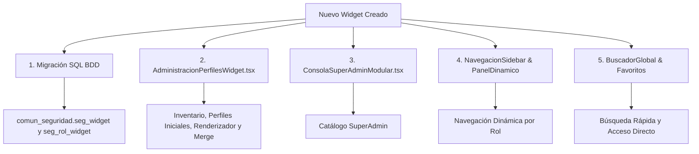

# Protocolo Obligatorio de Registro y Vinculación de Widgets en el Ecosistema

**Estado:** Vigente  
**Ámbito:** Transversal a todas las aplicaciones web del ecosistema (Tranqi, FastFix Home, Tinkay, Margaritas).  
**Propósito:** Garantizar que todo widget o módulo desarrollado quede inmediatamente disponible en la matriz de asignación de perfiles, inventario de herramientas, buscador global, consola de superadmin y navegación del sidebar.

---

## Flujo de Registro en 5 Puntos de Sincronización

Cuando se crea o incorpora un nuevo widget al código (por ejemplo: `billetera_documentos`), el desarrollador/agente **DEBE** completar sin excepción los siguientes 5 puntos:



---

### 1. Migración de Base de Datos (`comun_seguridad.seg_widget` & `seg_rol_widget`)
Crear un archivo de migración en `ecosistema/supabase/migrations/` registrando el widget para todos los negocios (`tranqi`, `fastfix`, `tinkay`, `margaritas`):

```sql
DO $$
DECLARE
  v_negocio text;
  v_negocios text[] := ARRAY['tranqi', 'fastfix', 'tinkay', 'margaritas'];
BEGIN
  FOREACH v_negocio IN ARRAY v_negocios
  LOOP
    -- 1. Insertar en seg_widget
    INSERT INTO comun_seguridad.seg_widget (
      wdg_negocio, wdg_clave, wdg_nombre, wdg_activo, wdg_detalle_widget, wdg_creado_en
    ) VALUES (
      v_negocio, 'clave_del_widget', 'Nombre Descriptivo del Widget', true,
      jsonb_build_object(
        'descripcion', 'Descripción funcional del módulo...',
        'categoria', 'Herramientas Digitales',
        'ruta', '/panel/ruta-del-widget',
        'panel_defecto', 'panel_herramientas',
        'icono', 'Folder'
      ),
      NOW()
    )
    ON CONFLICT (wdg_negocio, wdg_clave) DO UPDATE
    SET wdg_nombre = EXCLUDED.wdg_nombre, wdg_activo = true, wdg_detalle_widget = EXCLUDED.wdg_detalle_widget;

    -- 2. Asignar visibilidad por defecto a roles
    INSERT INTO comun_seguridad.seg_rol_widget (rlw_negocio, rlw_rol, rlw_widget_id, rlw_visible)
    SELECT v_negocio, rol_nombre, wdg_id, true
    FROM comun_seguridad.seg_widget
    CROSS JOIN (
      VALUES ('CLIENTE'), ('ABOGADO'), ('OPERADOR'), ('AUXILIAR'), ('TECNICO'), ('ADMINISTRADOR'), ('SUPERADMIN')
    ) AS roles(rol_nombre)
    WHERE wdg_clave = 'clave_del_widget' AND wdg_negocio = v_negocio
    ON CONFLICT (rlw_negocio, rlw_rol, rlw_widget_id) DO NOTHING;
  END LOOP;
END $$;
```

---

### 2. Matriz de Gobernanza & Perfiles (`AdministracionPerfilesWidget.tsx`)
En el paquete `@eco/gestion-usuarios` (`packages/gestion-usuarios/src/componentes/AdministracionPerfilesWidget.tsx`):

1. **`WIDGETS_INVENTARIO_INICIALES`**: Agregar la definición del widget (`clave`, `nombre`, `descripcion`, `categoria`, `ruta`, `rutaFisica`, `panelId`, `activo`, `creadoEn`).
2. **`PERFILES_INICIALES`**: Agregar la clave del widget a la lista del panel correspondiente (`panel_herramientas`, `panel_administrar`, `panel_configuracion`, etc.) en cada perfil base (`CLIENTE`, `OPERADOR`, `ABOGADO`, `ADMINISTRADOR`, `SUPERADMIN`).
3. **`RenderizadorWidgetReal`**: Agregar un caso en el `switch` para mostrar la tarjeta interactiva de previsualización.
4. **`useEffect (Merge de Estado)`**: Verificar que la función de carga desde `localStorage` fusione las listas de widgets del perfil base con las personalizaciones para que nunca se pierda un widget recién creado.

---

### 3. Catálogo SuperAdmin (`ConsolaSuperAdminModular.tsx`)
En `app/panel/ConsolaSuperAdminModular.tsx`, agregar la entrada en `CATALOGO_SUPERADMIN_TODOS`:
- `clave`, `nombre`, `detalle`, `ruta`, `icono`, `iconoKey`, `color`, `rutaFisica`.

---

### 4. Navegación del Sidebar y Paneles Dinámicos
1. **`NavegacionSidebar.tsx`**: Incluir la clave en los presets por rol de `widgetsPorPanel`.
2. **`[slug]/PanelDinamicoModular.tsx`**:
   - Agregar a `INVENTARIO_GLOBAL_WIDGETS`.
   - Agregar a `renderWidgetComponente`.
   - Agregar a los presets de `obtenerWidgetsInicialesDinamicos` y `cargarConfiguracion`.

---

### 5. Buscador Global y Accesos Rápidos
1. **`BuscadorModulosGlobal.tsx`**: Agregar la entrada en `MODULOS_SISTEMA`.
2. **`SeccionFavoritosInicio.tsx`**: Agregar la entrada en `CATALOGO_FAVORITOS`.

---

## Criterio de Aceptación Obligatorio
Ningún módulo o widget se considera finalizado si un administrador no puede:
1. Ver el widget en el catálogo de inventario de `/panel/configuracion?widget=perfiles` (pestaña *Inventario de Widgets*).
2. Asignar o retirar el widget a cualquier perfil/rol (pestaña *Módulos por Panel & Perfil*).
3. Abrir el widget en modo previsualización en vivo.
